# **App Flowchart**

## **High-Level System Architecture**

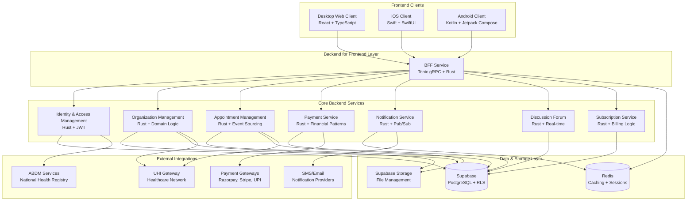

---

## **User Journey Flowcharts**

### **Patient User Journey**

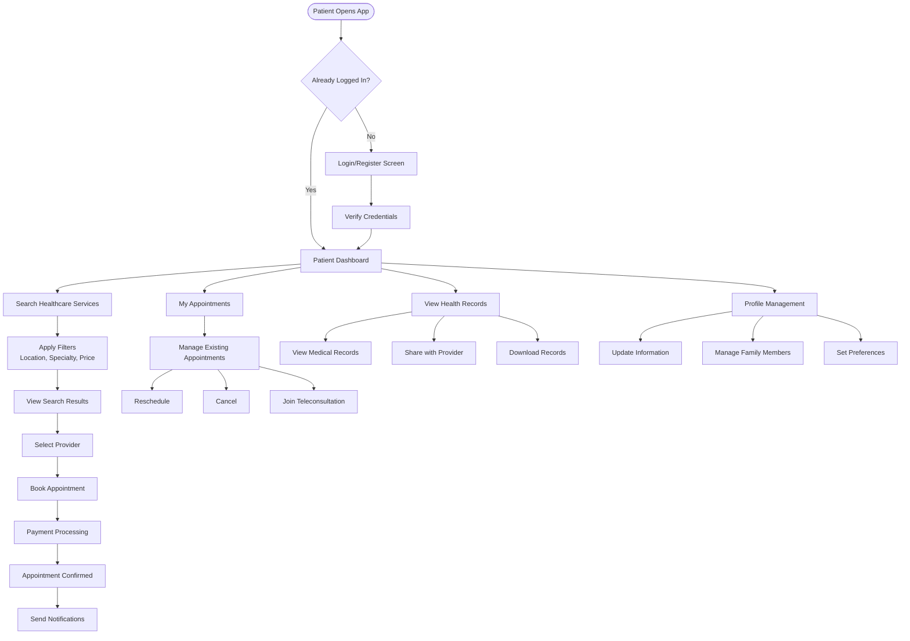

### **Healthcare Provider User Journey**

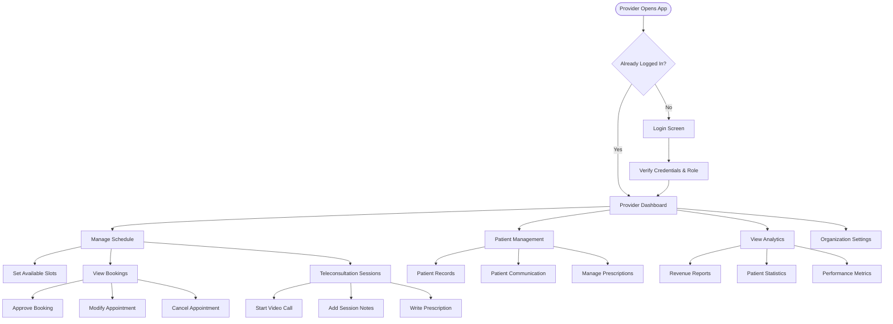

---

## **Data Flow Architecture**

### **Service Discovery & Appointment Booking Flow**

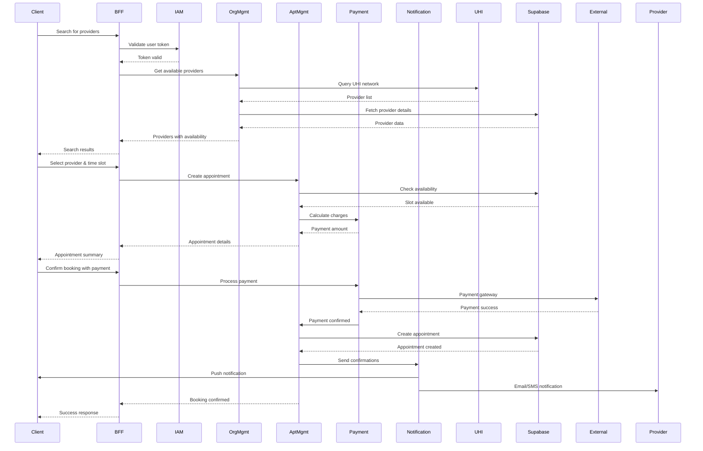

### **Authentication & Authorization Flow**

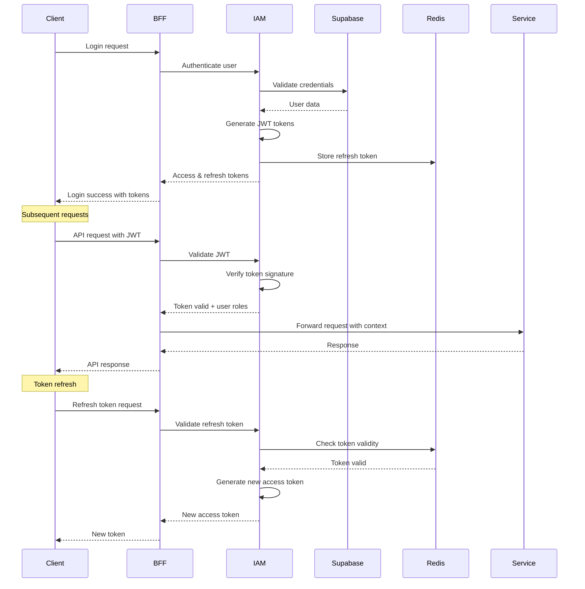

---

## **Component Interaction Diagrams**

### **Frontend Client Architecture**

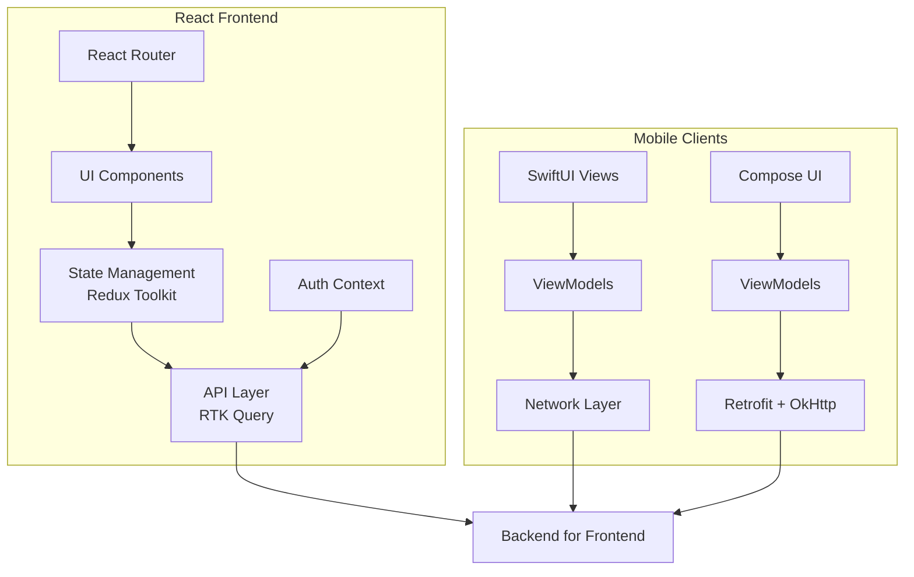

### **Backend Services Communication**

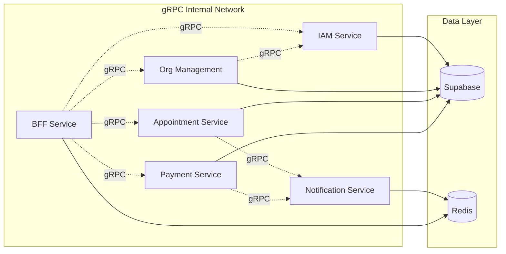

---

## **Real-Time Communication Flow**

### **Teleconsultation Session Flow**

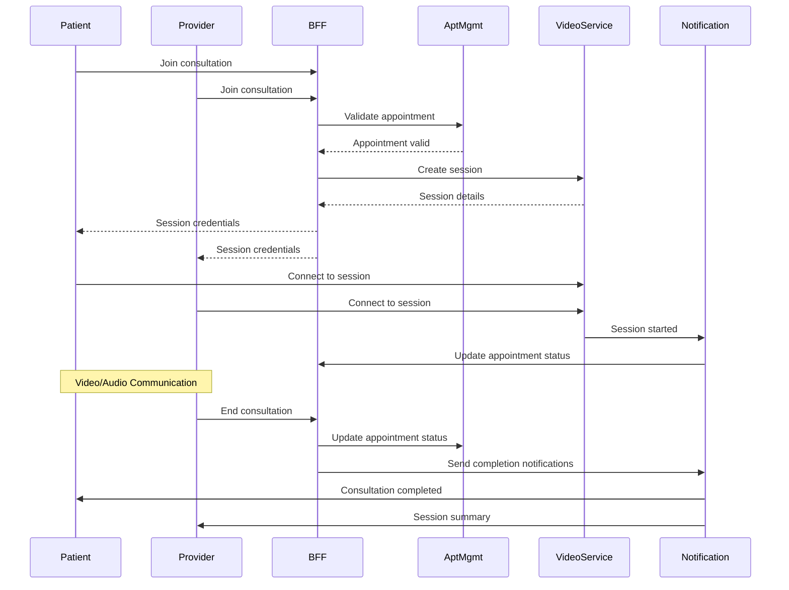

### **Real-Time Notification Flow**

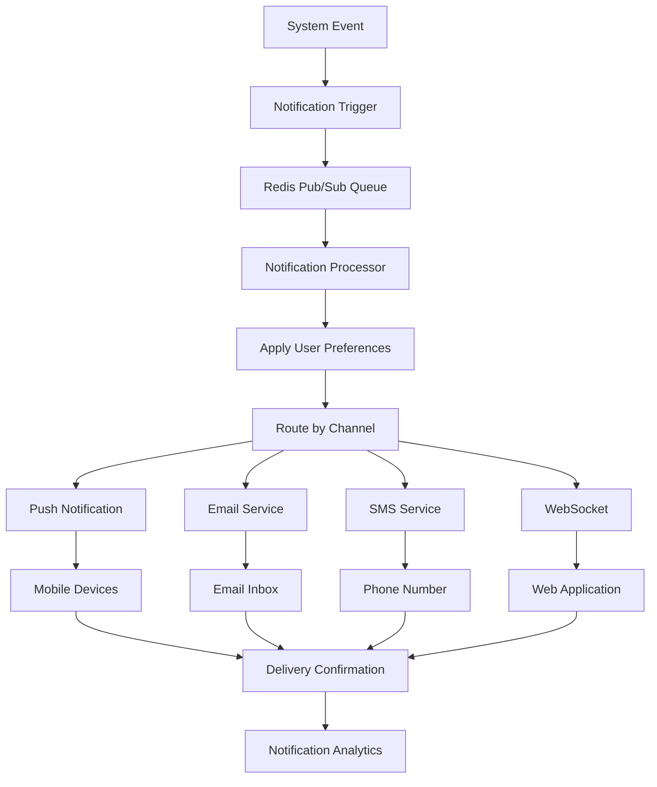

---

## **Error Handling & Recovery Flow**

### **Service Failure Recovery**

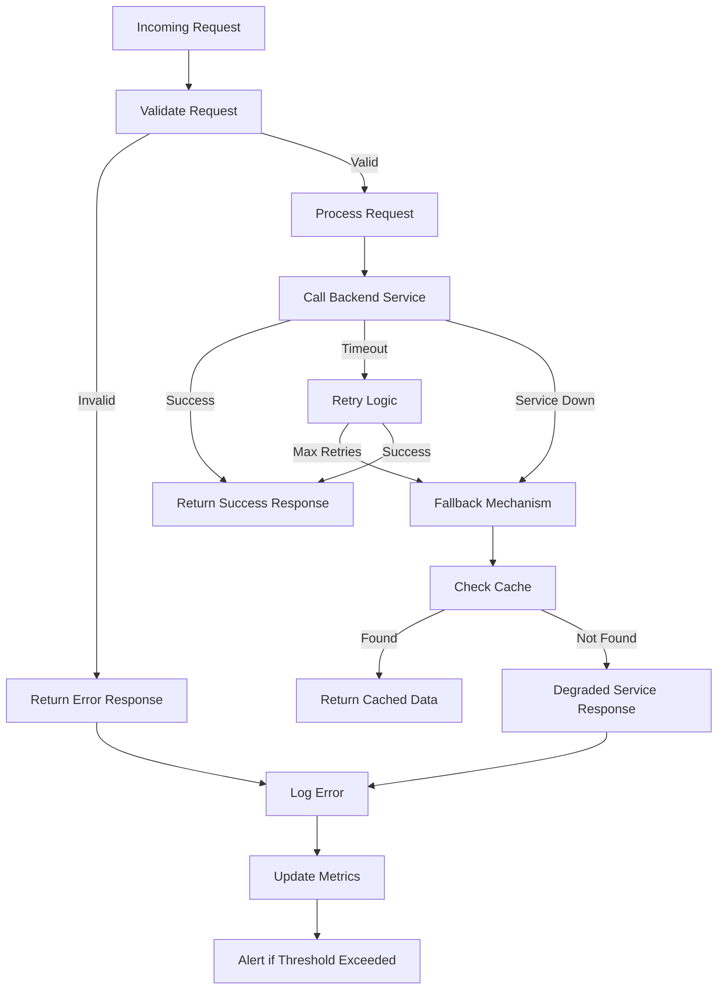

### **Data Consistency Flow**

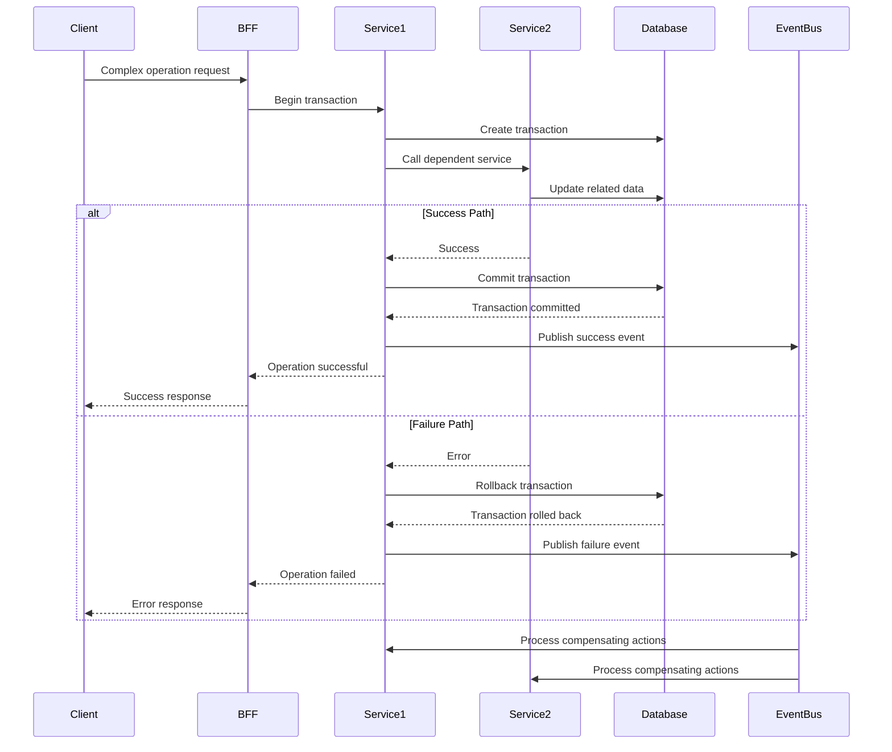

---

## **Performance Optimization Flow**

### **Caching Strategy**

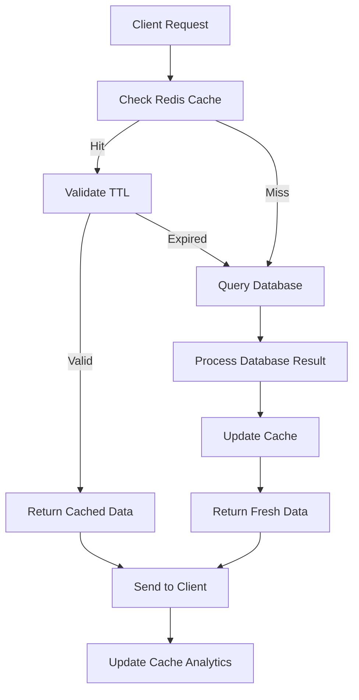

### **Load Balancing & Scaling**

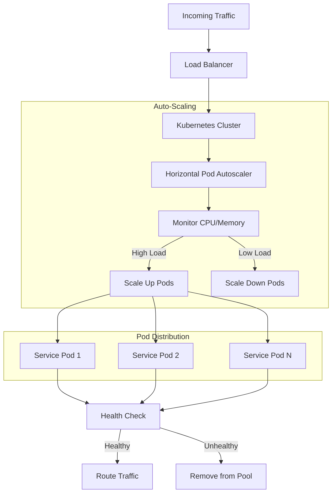

---

This comprehensive flowchart documentation provides a clear visual representation of the system architecture, user journeys, data flows, and operational procedures for the health tech platform.
