# **ABDM-Compliant Healthcare Platform - Application Flowcharts**

## **High-Level ABDM Ecosystem Architecture**

```mermaid
graph TB
    %% Frontend Clients
    subgraph "Frontend Clients"
        WEB[Desktop Web Client<br/>React + TypeScript]
        IOS[iOS Client<br/>Swift + SwiftUI]
        AND[Android Client<br/>Kotlin + Jetpack Compose]
        PWA[Progressive Web App<br/>Offline Capable]
    end

    %% Backend for Frontend
    subgraph "Backend for Frontend Layer"
        BFF[BFF Service<br/>Tonic gRPC + Rust]
        API_GW[API Gateway<br/>Rate Limiting + Authentication]
    end

    %% ABDM Core Services
    subgraph "ABDM Compliance Layer"
        ABHA[ABHA Service<br/>Health ID Management]
        UHI_GW[UHI Gateway<br/>Healthcare Protocol]
        EHR[EHR Service<br/>FHIR R4 Compliant]
        CONSENT[Consent Manager<br/>Granular Permissions]
        ANALYTICS[Analytics Service<br/>GraphQL + Healthcare Insights]
        HFR_SVC[Health Facility Registry Service<br/>Facility Registration & Management]
    end

    %% Core Healthcare Services
    subgraph "Healthcare Management Services"
        IAM[Identity & Access Management<br/>Multi-factor + Biometric]
        ORG[Organization Management<br/>HFR Integration]
        HPR[Healthcare Professional Registry<br/>Credential Verification]
        APT[Appointment Management<br/>UHI Compliant Booking]
        TELE[Teleconsultation Service<br/>Video + Session Management]
        CHRONIC[Chronic Care Management<br/>Disease Monitoring]
        DISCUSSION[Discussion Forum Service<br/>Community + Patient Communication]
        SUBSCRIPTION[Subscription Service<br/>Billing Cycles + Service Tiers]
    end

    %% Clinical & Operational Services
    subgraph "Clinical Services"
        CDX[Clinical Decision Support<br/>AI-Powered Diagnostics]
        PHARM[Telepharmacy Service<br/>Medication Management]
        LAB[Laboratory Integration<br/>Diagnostic Reports]
        IMAGING[Medical Imaging<br/>DICOM + FHIR]
        EMERGENCY[Emergency Services<br/>Critical Care Coordination]
    end

    %% Financial & Administrative Services
    subgraph "Financial & Administrative"
        NHCX[NHCX Integration<br/>Claims Processing]
        PAY[Payment Service<br/>Multi-gateway Integration]
        INS[Insurance Management<br/>Coverage Verification]
        BILLING[Billing & Invoicing<br/>Automated Processing]
        NOT[Notification Service<br/>Multi-channel Alerts]
    end

    %% Infrastructure & Deployment Services
    subgraph "Infrastructure & Operations"
        DEPLOY[Deployment Service<br/>Container Orchestration + Monitoring]
    end

    %% Data & Storage Layer
    subgraph "Data & Storage Layer"
        SUPA[(Supabase PostgreSQL<br/>RLS + Encryption)]
        REDIS[(Redis Cluster<br/>Session + Cache)]
        FHIR_STORE[(FHIR Data Store<br/>Clinical Documents)]
        AUDIT_LOG[(Audit Logs<br/>Compliance Tracking)]
        FILE_STORE[Encrypted File Storage<br/>Medical Documents]
    end

    %% ABDM External Integrations
    subgraph "ABDM Ecosystem"
        ABDM_HIP[Health Information Provider]
        ABDM_HIU[Health Information User]
        ABDM_HRP[Health Repository Provider]
        ABDM_PHR[Personal Health Records]
        GOVT_REG[Government Registries<br/>HFR + HPR + ABHA]
    end

    %% External Healthcare Network
    subgraph "Healthcare Network"
        UHI_NET[UHI Network Participants]
        HOSPITAL[Hospital Systems<br/>EMR Integration]
        PHARMACY[Pharmacy Networks]
        DIAGNOSTIC[Diagnostic Centers]
        INSURANCE[Insurance Providers]
    end

    %% Client Connections
    WEB --> API_GW
    IOS --> API_GW
    AND --> API_GW
    PWA --> API_GW
    API_GW --> BFF

    %% BFF to Core Services
    BFF --> ABHA
    BFF --> UHI_GW
    BFF --> EHR
    BFF --> CONSENT
    BFF --> ANALYTICS
    BFF --> IAM
    BFF --> ORG
    BFF --> HPR
    BFF --> APT
    BFF --> TELE
    BFF --> HFR_SVC
    BFF --> DISCUSSION
    BFF --> SUBSCRIPTION

    %% Healthcare Service Connections
    APT --> CDX
    APT --> PHARM
    APT --> LAB
    APT --> IMAGING
    TELE --> CDX
    CHRONIC --> CDX
    EMERGENCY --> CDX

    %% Financial Service Connections
    APT --> NHCX
    APT --> PAY
    PAY --> INS
    PAY --> BILLING
    BILLING --> NHCX

    %% Data Layer Connections
    ABHA --> SUPA
    EHR --> FHIR_STORE
    CONSENT --> SUPA
    IAM --> SUPA
    ORG --> SUPA
    HPR --> SUPA
    APT --> SUPA
    TELE --> SUPA
    CDX --> FHIR_STORE
    PHARM --> SUPA
    LAB --> FHIR_STORE
    IMAGING --> FHIR_STORE
    EMERGENCY --> SUPA
    NHCX --> SUPA
    PAY --> SUPA
    INS --> SUPA
    BILLING --> SUPA
    NOT --> REDIS
    BFF --> REDIS
    ANALYTICS --> FHIR_STORE
    HFR_SVC --> SUPA
    DISCUSSION --> SUPA
    SUBSCRIPTION --> SUPA
    CHRONIC --> FHIR_STORE
    DEPLOY --> REDIS
    
    %% File Storage
    EHR --> FILE_STORE
    LAB --> FILE_STORE
    IMAGING --> FILE_STORE
    
    %% Audit Logging
    IAM --> AUDIT_LOG
    EHR --> AUDIT_LOG
    CONSENT --> AUDIT_LOG
    NHCX --> AUDIT_LOG

    %% ABDM Ecosystem Integration
    ABHA --> GOVT_REG
    HPR --> GOVT_REG
    ORG --> GOVT_REG
    EHR --> ABDM_HIP
    EHR --> ABDM_HIU
    EHR --> ABDM_HRP
    CONSENT --> ABDM_PHR
    UHI_GW --> ABDM_PHR

    %% External Network Integration
    UHI_GW --> UHI_NET
    ORG --> HOSPITAL
    PHARM --> PHARMACY
    LAB --> DIAGNOSTIC
    NHCX --> INSURANCE
    EMERGENCY --> HOSPITAL
```

---

## **ABDM-Compliant User Journey Flowcharts**

### **Patient ABHA Registration & Onboarding Journey**

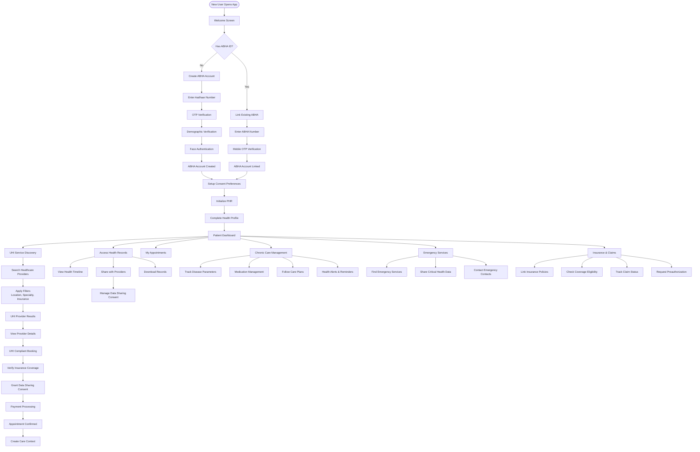
```mermaid
graph TD
    START([New User Opens App]) --> WELCOME[Welcome Screen]
    WELCOME --> ABHA_OPTION{Has ABHA ID?}
    
    ABHA_OPTION -->|No| CREATE_ABHA[Create ABHA Account]
    ABHA_OPTION -->|Yes| LINK_ABHA[Link Existing ABHA]
    
    CREATE_ABHA --> AADHAAR[Enter Aadhaar Number]
    AADHAAR --> OTP_VERIFY[OTP Verification]
    OTP_VERIFY --> DEMO_VERIFY[Demographic Verification]
    DEMO_VERIFY --> FACE_AUTH[Face Authentication]
    FACE_AUTH --> ABHA_CREATED[ABHA Account Created]
    
    LINK_ABHA --> ABHA_INPUT[Enter ABHA Number]
    ABHA_INPUT --> MOBILE_OTP[Mobile OTP Verification]
    MOBILE_OTP --> ABHA_LINKED[ABHA Account Linked]
    
    ABHA_CREATED --> CONSENT_SETUP[Setup Consent Preferences]
    ABHA_LINKED --> CONSENT_SETUP
    CONSENT_SETUP --> PHR_SETUP[Initialize PHR]
    PHR_SETUP --> PROFILE_COMPLETE[Complete Health Profile]
    PROFILE_COMPLETE --> DASHBOARD[Patient Dashboard]
    
    DASHBOARD --> DISCOVER[UHI Service Discovery]
    DASHBOARD --> PHR_ACCESS[Access Health Records]
    DASHBOARD --> APPOINTMENTS[My Appointments]
    DASHBOARD --> CHRONIC_CARE[Chronic Care Management]
    DASHBOARD --> EMERGENCY[Emergency Services]
    DASHBOARD --> INSURANCE[Insurance & Claims]
    
    DISCOVER --> UHI_SEARCH[Search Healthcare Providers]
    UHI_SEARCH --> FILTERS[Apply Filters<br/>Location, Specialty, Insurance]
    FILTERS --> PROVIDER_LIST[UHI Provider Results]
    PROVIDER_LIST --> PROVIDER_DETAILS[View Provider Details]
    PROVIDER_DETAILS --> BOOK_APPOINTMENT[UHI Compliant Booking]
    
    BOOK_APPOINTMENT --> INSURANCE_CHECK[Verify Insurance Coverage]
    INSURANCE_CHECK --> CONSENT_GRANT[Grant Data Sharing Consent]
    CONSENT_GRANT --> PAYMENT_FLOW[Payment Processing]
    PAYMENT_FLOW --> APPOINTMENT_CONFIRMED[Appointment Confirmed]
    APPOINTMENT_CONFIRMED --> CARE_CONTEXT[Create Care Context]
    
    PHR_ACCESS --> HEALTH_TIMELINE[View Health Timeline]
    PHR_ACCESS --> SHARE_RECORDS[Share with Providers]
    PHR_ACCESS --> DOWNLOAD_RECORDS[Download Records]
    SHARE_RECORDS --> CONSENT_MANAGEMENT[Manage Data Sharing Consent]
    
    CHRONIC_CARE --> DISEASE_TRACKING[Track Disease Parameters]
    CHRONIC_CARE --> MEDICATION_MGMT[Medication Management]
    CHRONIC_CARE --> CARE_PLAN[Follow Care Plans]
    CHRONIC_CARE --> ALERTS[Health Alerts & Reminders]
    
    EMERGENCY --> LOCATE_SERVICES[Find Emergency Services]
    EMERGENCY --> SHARE_CRITICAL_DATA[Share Critical Health Data]
    EMERGENCY --> EMERGENCY_CONTACTS[Contact Emergency Contacts]
    
    INSURANCE --> POLICY_LINK[Link Insurance Policies]
    INSURANCE --> COVERAGE_CHECK[Check Coverage Eligibility]
    INSURANCE --> CLAIM_STATUS[Track Claim Status]
    INSURANCE --> PREAUTH[Request Preauthorization]
```

### **Healthcare Provider HPR Registration & Workflow**

```mermaid
graph TD
    START([Healthcare Professional Opens App]) --> AUTH{Already Registered?}
    
    AUTH -->|No| HPR_REGISTER[HPR Registration]
    AUTH -->|Yes| LOGIN[Login with HPR ID]
    
    HPR_REGISTER --> PROFESSIONAL_TYPE[Select Professional Type<br/>Doctor/Nurse/Allied Health]
    PROFESSIONAL_TYPE --> CREDENTIALS[Upload Professional Credentials]
    CREDENTIALS --> MEDICAL_COUNCIL[Medical Council Verification]
    MEDICAL_COUNCIL --> FACILITY_LINK[Link to Health Facility]
    FACILITY_LINK --> HPR_APPROVED[HPR Registration Approved]
    
    LOGIN --> MFA[Multi-Factor Authentication]
    HPR_APPROVED --> MFA
    MFA --> DASHBOARD[Provider Dashboard]
    
    DASHBOARD --> HFR_MGMT[Health Facility Management]
    DASHBOARD --> PATIENT_CARE[Patient Care Workflows]
    DASHBOARD --> CLINICAL_TOOLS[Clinical Decision Support]
    DASHBOARD --> CLAIMS_MGMT[Claims & Insurance Management]
    DASHBOARD --> ANALYTICS[Healthcare Analytics]
    DASHBOARD --> COMPLIANCE[Regulatory Compliance]
    
    HFR_MGMT --> FACILITY_REG[Register/Update Facility]
    HFR_MGMT --> SERVICE_CATALOG[Manage Service Catalog]
    HFR_MGMT --> STAFF_MGMT[Staff Management]
    HFR_MGMT --> CAPACITY_MGMT[Capacity Management]
    
    PATIENT_CARE --> APPOINTMENT_MGMT[Appointment Management]
    PATIENT_CARE --> EHR_ACCESS[Electronic Health Records]
    PATIENT_CARE --> TELECONSULT[Teleconsultation Platform]
    PATIENT_CARE --> PRESCRIPTION[Digital Prescriptions]
    PATIENT_CARE --> CARE_COORDINATION[Care Team Coordination]
    
    APPOINTMENT_MGMT --> VIEW_BOOKINGS[View UHI Bookings]
    APPOINTMENT_MGMT --> MANAGE_SLOTS[Manage Available Slots]
    APPOINTMENT_MGMT --> PATIENT_COMM[Patient Communication]
    
    EHR_ACCESS --> FHIR_RECORDS[FHIR R4 Patient Records]
    EHR_ACCESS --> CONSENT_REQUEST[Request Data Access Consent]
    EHR_ACCESS --> CLINICAL_DOCS[Clinical Documentation]
    EHR_ACCESS --> LAB_INTEGRATION[Laboratory Results]
    
    TELECONSULT --> VIDEO_SESSION[Start Video Consultation]
    TELECONSULT --> SESSION_NOTES[Clinical Session Notes]
    TELECONSULT --> REMOTE_MONITORING[Remote Patient Monitoring]
    
    PRESCRIPTION --> DIGITAL_RX[Create Digital Prescription]
    PRESCRIPTION --> DRUG_INTERACTION[Drug Interaction Checking]
    PRESCRIPTION --> PHARMACY_INTEGRATION[Send to Pharmacy]
    
    CLINICAL_TOOLS --> DIAGNOSIS_SUPPORT[AI Diagnosis Support]
    CLINICAL_TOOLS --> TREATMENT_GUIDELINES[Evidence-based Guidelines]
    CLINICAL_TOOLS --> RISK_ASSESSMENT[Patient Risk Assessment]
    CLINICAL_TOOLS --> OUTCOME_TRACKING[Clinical Outcome Tracking]
    
    CLAIMS_MGMT --> NHCX_INTEGRATION[NHCX Claims Processing]
    CLAIMS_MGMT --> PREAUTH_MGMT[Preauthorization Management]
    CLAIMS_MGMT --> BILLING_AUTOMATION[Automated Billing]
    CLAIMS_MGMT --> PAYMENT_RECONCILIATION[Payment Reconciliation]
    
    ANALYTICS --> PATIENT_INSIGHTS[Patient Population Insights]
    ANALYTICS --> PERFORMANCE_METRICS[Clinical Performance Metrics]
    ANALYTICS --> REVENUE_ANALYTICS[Revenue & Financial Analytics]
    ANALYTICS --> QUALITY_INDICATORS[Quality Improvement Indicators]
    
    COMPLIANCE --> AUDIT_LOGS[Access Audit Logs]
    COMPLIANCE --> REGULATORY_REPORTS[Generate Regulatory Reports]
    COMPLIANCE --> DATA_PRIVACY[Data Privacy Compliance]
    COMPLIANCE --> CERTIFICATION_TRACKING[Professional Certification Tracking]
```

### **Emergency Healthcare Access Flow**

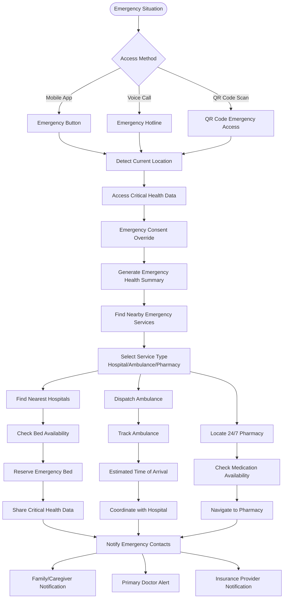
```mermaid
graph TD
    EMERGENCY_START([Emergency Situation]) --> ACCESS_METHOD{Access Method}
    
    ACCESS_METHOD -->|Mobile App| EMERGENCY_BUTTON[Emergency Button]
    ACCESS_METHOD -->|Voice Call| EMERGENCY_HOTLINE[Emergency Hotline]
    ACCESS_METHOD -->|QR Code Scan| QR_EMERGENCY[QR Code Emergency Access]
    
    EMERGENCY_BUTTON --> LOCATION[Detect Current Location]
    EMERGENCY_HOTLINE --> LOCATION
    QR_EMERGENCY --> LOCATION
    
    LOCATION --> CRITICAL_DATA[Access Critical Health Data]
    CRITICAL_DATA --> CONSENT_OVERRIDE[Emergency Consent Override]
    CONSENT_OVERRIDE --> HEALTH_SUMMARY[Generate Emergency Health Summary]
    
    HEALTH_SUMMARY --> NEARBY_SERVICES[Find Nearby Emergency Services]
    NEARBY_SERVICES --> SERVICE_SELECTION[Select Service Type<br/>Hospital/Ambulance/Pharmacy]
    
    SERVICE_SELECTION --> HOSPITAL_SEARCH[Find Nearest Hospitals]
    SERVICE_SELECTION --> AMBULANCE_DISPATCH[Dispatch Ambulance]
    SERVICE_SELECTION --> PHARMACY_LOCATE[Locate 24/7 Pharmacy]
    
    HOSPITAL_SEARCH --> BED_AVAILABILITY[Check Bed Availability]
    BED_AVAILABILITY --> HOSPITAL_BOOKING[Reserve Emergency Bed]
    HOSPITAL_BOOKING --> SHARE_HEALTH_DATA[Share Critical Health Data]
    
    AMBULANCE_DISPATCH --> AMBULANCE_TRACKING[Track Ambulance]
    AMBULANCE_TRACKING --> ETA[Estimated Time of Arrival]
    ETA --> HOSPITAL_COORDINATION[Coordinate with Hospital]
    
    PHARMACY_LOCATE --> MEDICATION_AVAILABILITY[Check Medication Availability]
    MEDICATION_AVAILABILITY --> PHARMACY_NAVIGATION[Navigate to Pharmacy]
    
    SHARE_HEALTH_DATA --> EMERGENCY_CONTACTS[Notify Emergency Contacts]
    HOSPITAL_COORDINATION --> EMERGENCY_CONTACTS
    PHARMACY_NAVIGATION --> EMERGENCY_CONTACTS
    
    EMERGENCY_CONTACTS --> FAMILY_NOTIFICATION[Family/Caregiver Notification]
    EMERGENCY_CONTACTS --> DOCTOR_ALERT[Primary Doctor Alert]
    EMERGENCY_CONTACTS --> INSURANCE_NOTIFICATION[Insurance Provider Notification]
```

---

## **ABDM-Compliant Data Flow Architecture**

### **ABHA Registration & Verification Flow**

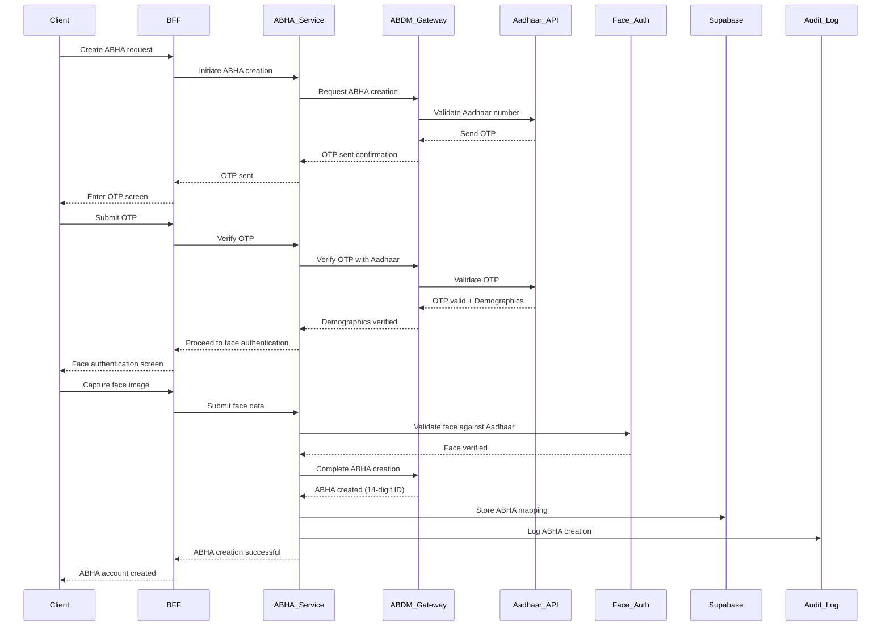
```mermaid
sequenceDiagram
    participant Client
    participant BFF
    participant ABHA_Service
    participant ABDM_Gateway
    participant Aadhaar_API
    participant Face_Auth
    participant Supabase
    participant Audit_Log

    Client->>BFF: Create ABHA request
    BFF->>ABHA_Service: Initiate ABHA creation
    ABHA_Service->>ABDM_Gateway: Request ABHA creation
    
    ABDM_Gateway->>Aadhaar_API: Validate Aadhaar number
    Aadhaar_API-->>ABDM_Gateway: Send OTP
    ABDM_Gateway-->>ABHA_Service: OTP sent confirmation
    ABHA_Service-->>BFF: OTP sent
    BFF-->>Client: Enter OTP screen
    
    Client->>BFF: Submit OTP
    BFF->>ABHA_Service: Verify OTP
    ABHA_Service->>ABDM_Gateway: Verify OTP with Aadhaar
    ABDM_Gateway->>Aadhaar_API: Validate OTP
    Aadhaar_API-->>ABDM_Gateway: OTP valid + Demographics
    
    ABDM_Gateway-->>ABHA_Service: Demographics verified
    ABHA_Service-->>BFF: Proceed to face authentication
    BFF-->>Client: Face authentication screen
    
    Client->>BFF: Capture face image
    BFF->>ABHA_Service: Submit face data
    ABHA_Service->>Face_Auth: Validate face against Aadhaar
    Face_Auth-->>ABHA_Service: Face verified
    
    ABHA_Service->>ABDM_Gateway: Complete ABHA creation
    ABDM_Gateway-->>ABHA_Service: ABHA created (14-digit ID)
    ABHA_Service->>Supabase: Store ABHA mapping
    ABHA_Service->>Audit_Log: Log ABHA creation
    
    ABHA_Service-->>BFF: ABHA creation successful
    BFF-->>Client: ABHA account created
```

### **UHI Service Discovery & Booking Flow**

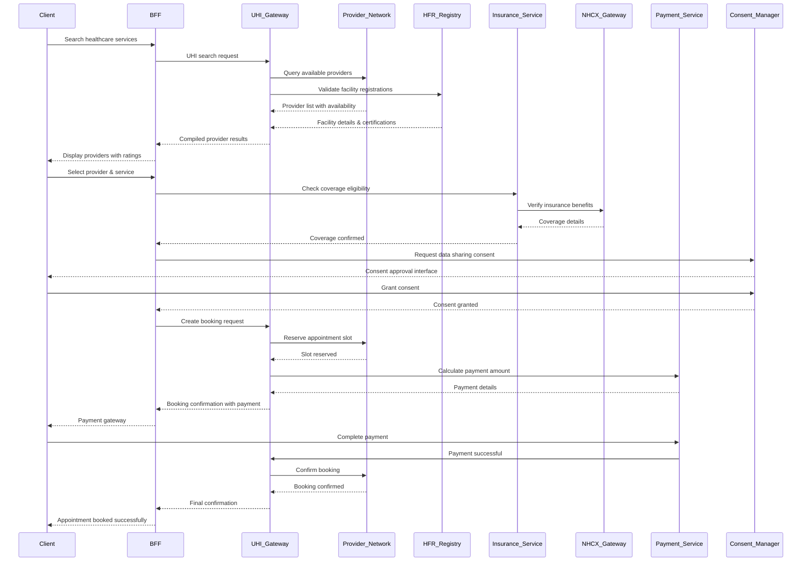
```mermaid
sequenceDiagram
    participant Client
    participant BFF
    participant UHI_Gateway
    participant Provider_Network
    participant HFR_Registry
    participant Insurance_Service
    participant NHCX_Gateway
    participant Payment_Service
    participant Consent_Manager

    Client->>BFF: Search healthcare services
    BFF->>UHI_Gateway: UHI search request
    UHI_Gateway->>Provider_Network: Query available providers
    UHI_Gateway->>HFR_Registry: Validate facility registrations
    
    Provider_Network-->>UHI_Gateway: Provider list with availability
    HFR_Registry-->>UHI_Gateway: Facility details & certifications
    UHI_Gateway-->>BFF: Compiled provider results
    BFF-->>Client: Display providers with ratings
    
    Client->>BFF: Select provider & service
    BFF->>Insurance_Service: Check coverage eligibility
    Insurance_Service->>NHCX_Gateway: Verify insurance benefits
    NHCX_Gateway-->>Insurance_Service: Coverage details
    Insurance_Service-->>BFF: Coverage confirmed
    
    BFF->>Consent_Manager: Request data sharing consent
    Consent_Manager-->>Client: Consent approval interface
    Client->>Consent_Manager: Grant consent
    Consent_Manager-->>BFF: Consent granted
    
    BFF->>UHI_Gateway: Create booking request
    UHI_Gateway->>Provider_Network: Reserve appointment slot
    Provider_Network-->>UHI_Gateway: Slot reserved
    
    UHI_Gateway->>Payment_Service: Calculate payment amount
    Payment_Service-->>UHI_Gateway: Payment details
    UHI_Gateway-->>BFF: Booking confirmation with payment
    BFF-->>Client: Payment gateway
    
    Client->>Payment_Service: Complete payment
    Payment_Service->>UHI_Gateway: Payment successful
    UHI_Gateway->>Provider_Network: Confirm booking
    Provider_Network-->>UHI_Gateway: Booking confirmed
    
    UHI_Gateway-->>BFF: Final confirmation
    BFF-->>Client: Appointment booked successfully
```

### **FHIR R4 Health Information Exchange Flow**

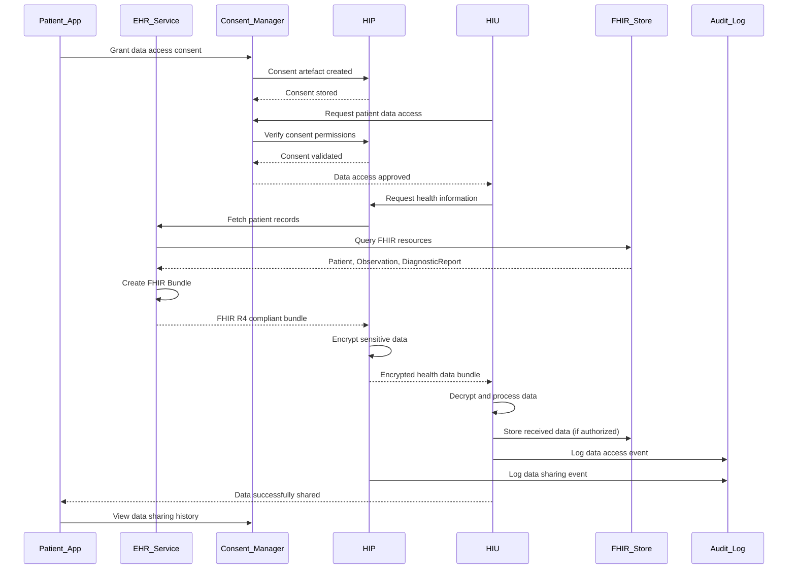
```mermaid
sequenceDiagram
    participant Patient_App
    participant EHR_Service
    participant Consent_Manager
    participant HIP
    participant HIU
    participant FHIR_Store
    participant Audit_Log

    Patient_App->>Consent_Manager: Grant data access consent
    Consent_Manager->>HIP: Consent artefact created
    HIP-->>Consent_Manager: Consent stored
    
    HIU->>Consent_Manager: Request patient data access
    Consent_Manager->>HIP: Verify consent permissions
    HIP-->>Consent_Manager: Consent validated
    
    Consent_Manager-->>HIU: Data access approved
    HIU->>HIP: Request health information
    HIP->>EHR_Service: Fetch patient records
    
    EHR_Service->>FHIR_Store: Query FHIR resources
    FHIR_Store-->>EHR_Service: Patient, Observation, DiagnosticReport
    EHR_Service->>EHR_Service: Create FHIR Bundle
    
    EHR_Service-->>HIP: FHIR R4 compliant bundle
    HIP->>HIP: Encrypt sensitive data
    HIP-->>HIU: Encrypted health data bundle
    
    HIU->>HIU: Decrypt and process data
    HIU->>FHIR_Store: Store received data (if authorized)
    HIU->>Audit_Log: Log data access event
    HIP->>Audit_Log: Log data sharing event
    
    HIU-->>Patient_App: Data successfully shared
    Patient_App->>Consent_Manager: View data sharing history
```

### **NHCX Claims Processing Flow**

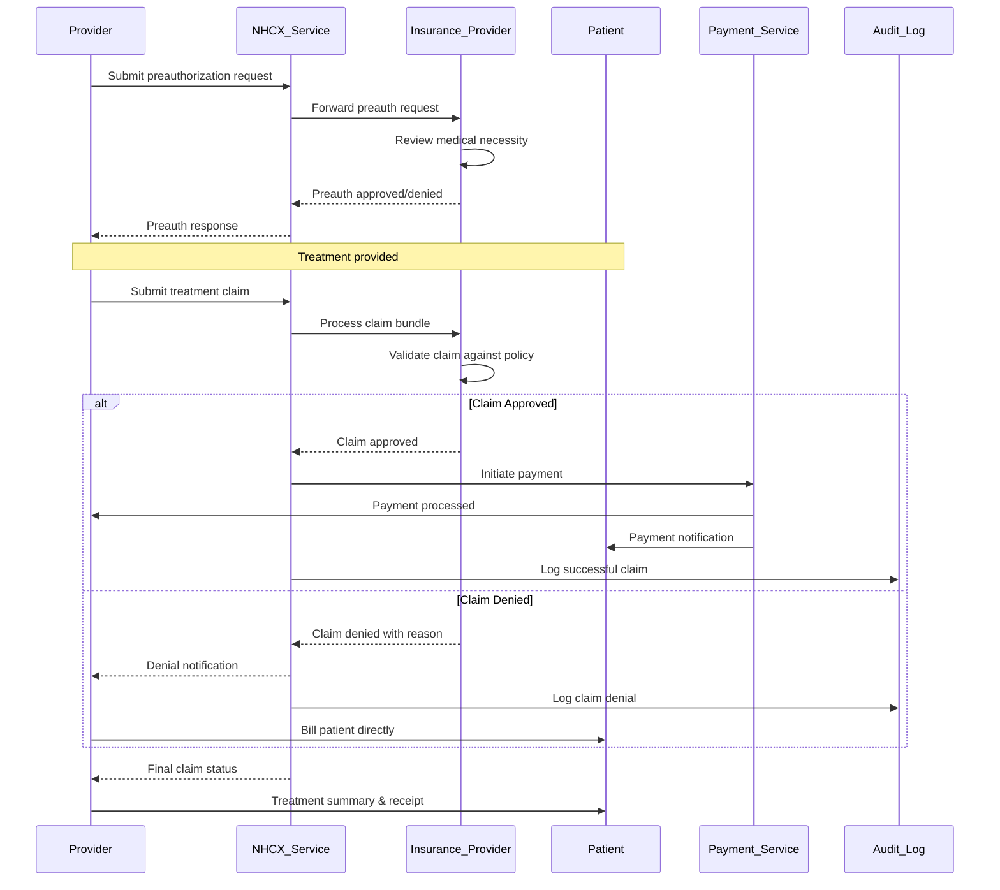
```mermaid
sequenceDiagram
    participant Provider
    participant NHCX_Service
    participant Insurance_Provider
    participant Patient
    participant Payment_Service
    participant Audit_Log

    Provider->>NHCX_Service: Submit preauthorization request
    NHCX_Service->>Insurance_Provider: Forward preauth request
    Insurance_Provider->>Insurance_Provider: Review medical necessity
    Insurance_Provider-->>NHCX_Service: Preauth approved/denied
    NHCX_Service-->>Provider: Preauth response
    
    Note over Provider,Patient: Treatment provided
    
    Provider->>NHCX_Service: Submit treatment claim
    NHCX_Service->>Insurance_Provider: Process claim bundle
    Insurance_Provider->>Insurance_Provider: Validate claim against policy
    
    alt Claim Approved
        Insurance_Provider-->>NHCX_Service: Claim approved
        NHCX_Service->>Payment_Service: Initiate payment
        Payment_Service->>Provider: Payment processed
        Payment_Service->>Patient: Payment notification
        NHCX_Service->>Audit_Log: Log successful claim
    else Claim Denied
        Insurance_Provider-->>NHCX_Service: Claim denied with reason
        NHCX_Service-->>Provider: Denial notification
        NHCX_Service->>Audit_Log: Log claim denial
        Provider->>Patient: Bill patient directly
    end
    
    NHCX_Service-->>Provider: Final claim status
    Provider->>Patient: Treatment summary & receipt
```

### **Emergency Healthcare Data Access Flow**

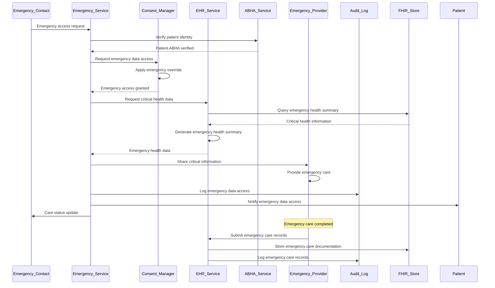
```mermaid
sequenceDiagram
    participant Emergency_Contact
    participant Emergency_Service
    participant Consent_Manager
    participant EHR_Service
    participant ABHA_Service
    participant Emergency_Provider
    participant Audit_Log

    Emergency_Contact->>Emergency_Service: Emergency access request
    Emergency_Service->>ABHA_Service: Verify patient identity
    ABHA_Service-->>Emergency_Service: Patient ABHA verified
    
    Emergency_Service->>Consent_Manager: Request emergency data access
    Consent_Manager->>Consent_Manager: Apply emergency override
    Consent_Manager-->>Emergency_Service: Emergency access granted
    
    Emergency_Service->>EHR_Service: Request critical health data
    EHR_Service->>FHIR_Store: Query emergency health summary
    FHIR_Store-->>EHR_Service: Critical health information
    
    EHR_Service->>EHR_Service: Generate emergency health summary
    EHR_Service-->>Emergency_Service: Emergency health data
    
    Emergency_Service->>Emergency_Provider: Share critical information
    Emergency_Provider->>Emergency_Provider: Provide emergency care
    
    Emergency_Service->>Audit_Log: Log emergency data access
    Emergency_Service->>Patient: Notify emergency data access
    Emergency_Service->>Emergency_Contact: Care status update
    
    Note over Emergency_Provider: Emergency care completed
    
    Emergency_Provider->>EHR_Service: Submit emergency care records
    EHR_Service->>FHIR_Store: Store emergency care documentation
    EHR_Service->>Audit_Log: Log emergency care records
```

### **Chronic Disease Management Data Flow**

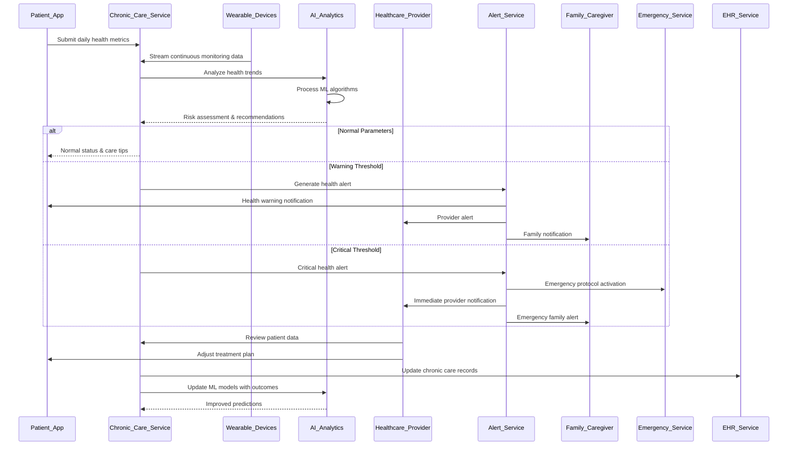
```mermaid
sequenceDiagram
    participant Patient_App
    participant Chronic_Care_Service
    participant Wearable_Devices
    participant AI_Analytics
    participant Healthcare_Provider
    participant Alert_Service
    participant Family_Caregiver

    Patient_App->>Chronic_Care_Service: Submit daily health metrics
    Wearable_Devices->>Chronic_Care_Service: Stream continuous monitoring data
    
    Chronic_Care_Service->>AI_Analytics: Analyze health trends
    AI_Analytics->>AI_Analytics: Process ML algorithms
    AI_Analytics-->>Chronic_Care_Service: Risk assessment & recommendations
    
    alt Normal Parameters
        Chronic_Care_Service-->>Patient_App: Normal status & care tips
    else Warning Threshold
        Chronic_Care_Service->>Alert_Service: Generate health alert
        Alert_Service->>Patient_App: Health warning notification
        Alert_Service->>Healthcare_Provider: Provider alert
        Alert_Service->>Family_Caregiver: Family notification
    else Critical Threshold
        Chronic_Care_Service->>Alert_Service: Critical health alert
        Alert_Service->>Emergency_Service: Emergency protocol activation
        Alert_Service->>Healthcare_Provider: Immediate provider notification
        Alert_Service->>Family_Caregiver: Emergency family alert
    end
    
    Healthcare_Provider->>Chronic_Care_Service: Review patient data
    Healthcare_Provider->>Patient_App: Adjust treatment plan
    Chronic_Care_Service->>EHR_Service: Update chronic care records
    
    Chronic_Care_Service->>AI_Analytics: Update ML models with outcomes
    AI_Analytics-->>Chronic_Care_Service: Improved predictions
```

---

## **Component Interaction Diagrams**

### **Frontend Client Architecture**

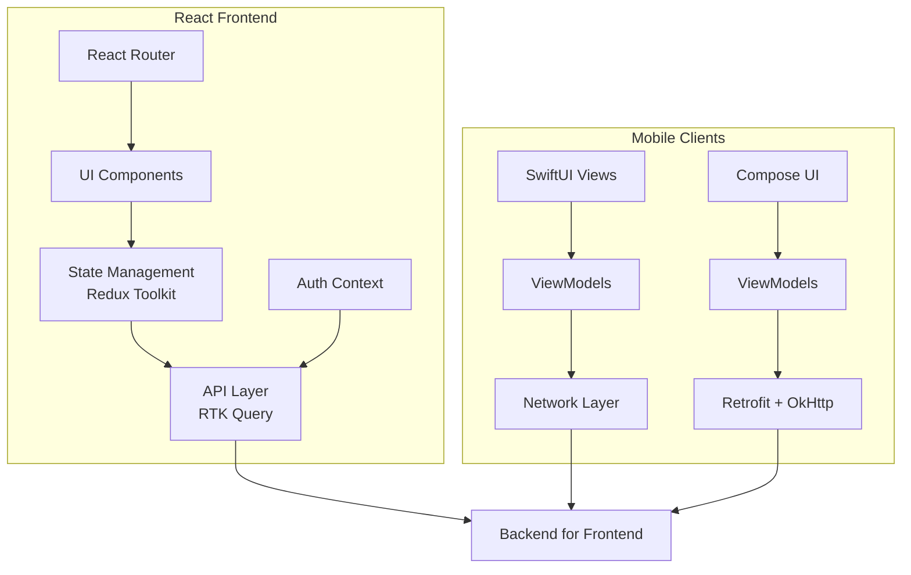
```mermaid
graph TD
    subgraph "React Frontend"
        UI[UI Components]
        STATE[State Management<br/>Redux Toolkit]
        API[API Layer<br/>RTK Query]
        AUTH[Auth Context]
        ROUTER[React Router]
    end
    
    subgraph "Mobile Clients"
        IOS_UI[SwiftUI Views]
        IOS_VM[ViewModels]
        IOS_NET[Network Layer]
        
        AND_UI[Compose UI]
        AND_VM[ViewModels]
        AND_NET[Retrofit + OkHttp]
    end
    
    UI --> STATE
    STATE --> API
    API --> BFF[Backend for Frontend]
    AUTH --> API
    ROUTER --> UI
    
    IOS_UI --> IOS_VM
    IOS_VM --> IOS_NET
    IOS_NET --> BFF
    
    AND_UI --> AND_VM
    AND_VM --> AND_NET
    AND_NET --> BFF
```

### **Backend Services Communication**

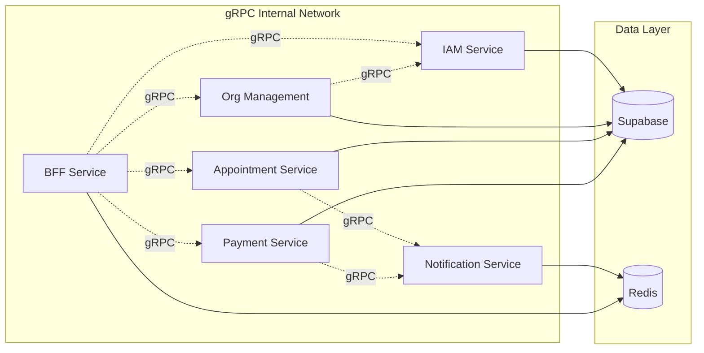
```mermaid
graph LR
    subgraph "gRPC Internal Network"
        BFF[BFF Service] 
        IAM[IAM Service]
        ORG[Org Management]
        APT[Appointment Service]
        PAY[Payment Service]
        NOT[Notification Service]
    end
    
    BFF -.->|gRPC| IAM
    BFF -.->|gRPC| ORG
    BFF -.->|gRPC| APT
    BFF -.->|gRPC| PAY
    
    APT -.->|gRPC| NOT
    PAY -.->|gRPC| NOT
    ORG -.->|gRPC| IAM
    
    subgraph "Data Layer"
        SUPA[(Supabase)]
        REDIS[(Redis)]
    end
    
    IAM --> SUPA
    ORG --> SUPA
    APT --> SUPA
    PAY --> SUPA
    NOT --> REDIS
    BFF --> REDIS
```

---

## **Real-Time Communication Flow**

### **Teleconsultation Session Flow**

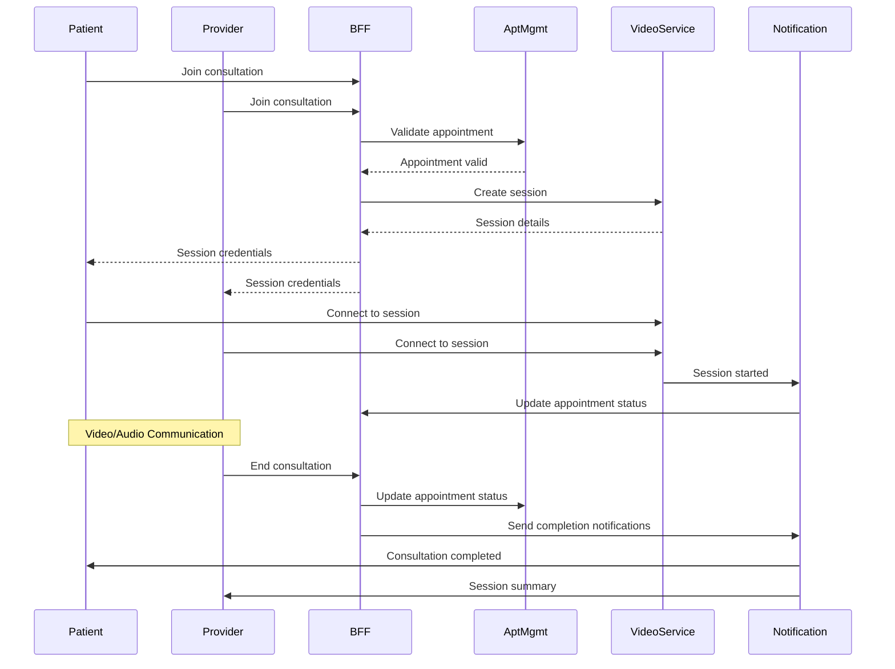
```mermaid
sequenceDiagram
    participant Patient
    participant Provider
    participant BFF
    participant AptMgmt
    participant VideoService
    participant Notification

    Patient->>BFF: Join consultation
    Provider->>BFF: Join consultation
    
    BFF->>AptMgmt: Validate appointment
    AptMgmt-->>BFF: Appointment valid
    
    BFF->>VideoService: Create session
    VideoService-->>BFF: Session details
    
    BFF-->>Patient: Session credentials
    BFF-->>Provider: Session credentials
    
    Patient->>VideoService: Connect to session
    Provider->>VideoService: Connect to session
    
    VideoService->>Notification: Session started
    Notification->>BFF: Update appointment status
    
    Note over Patient,Provider: Video/Audio Communication
    
    Provider->>BFF: End consultation
    BFF->>AptMgmt: Update appointment status
    BFF->>Notification: Send completion notifications
    
    Notification->>Patient: Consultation completed
    Notification->>Provider: Session summary
```

### **Real-Time Notification Flow**

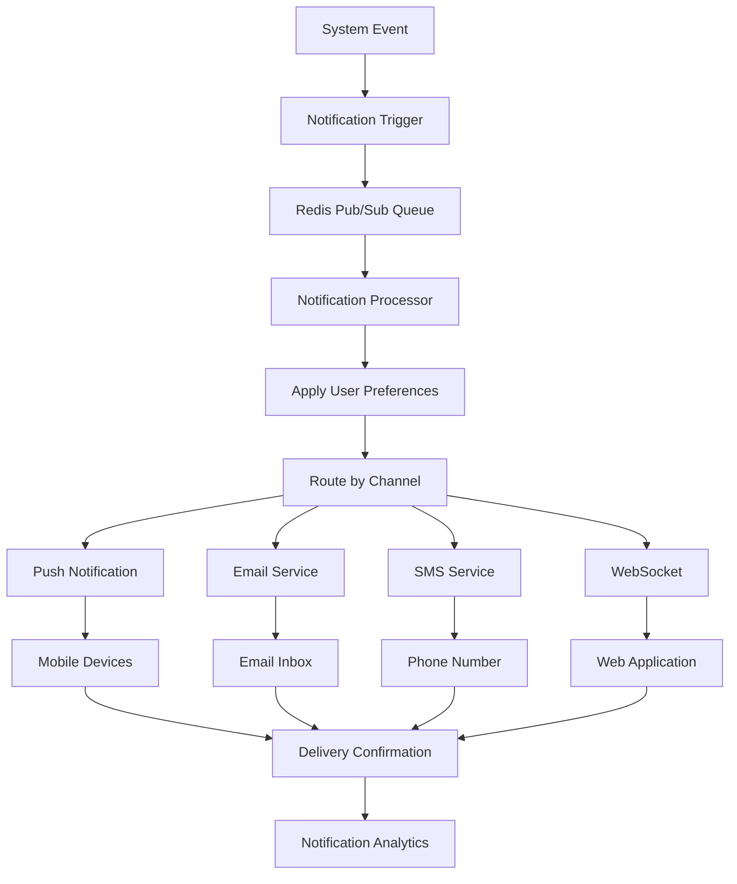
```mermaid
graph TD
    EVENT[System Event] --> TRIGGER[Notification Trigger]
    
    TRIGGER --> QUEUE[Redis Pub/Sub Queue]
    QUEUE --> PROCESSOR[Notification Processor]
    
    PROCESSOR --> FILTER[Apply User Preferences]
    FILTER --> ROUTE[Route by Channel]
    
    ROUTE --> PUSH[Push Notification]
    ROUTE --> EMAIL[Email Service]
    ROUTE --> SMS[SMS Service]
    ROUTE --> WEBSOCKET[WebSocket]
    
    PUSH --> MOBILE[Mobile Devices]
    EMAIL --> INBOX[Email Inbox]
    SMS --> PHONE[Phone Number]
    WEBSOCKET --> WEBAPP[Web Application]
    
    MOBILE --> DELIVERY[Delivery Confirmation]
    INBOX --> DELIVERY
    PHONE --> DELIVERY
    WEBAPP --> DELIVERY
    
    DELIVERY --> ANALYTICS[Notification Analytics]
```

---

## **Error Handling & Recovery Flow**

### **Service Failure Recovery**

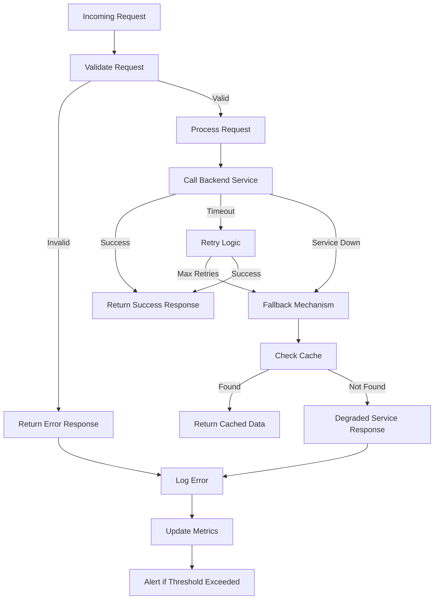
```mermaid
graph TD
    REQUEST[Incoming Request] --> VALIDATE[Validate Request]
    VALIDATE -->|Invalid| ERROR[Return Error Response]
    VALIDATE -->|Valid| PROCESS[Process Request]
    
    PROCESS --> SERVICE_CALL[Call Backend Service]
    SERVICE_CALL -->|Success| RESPONSE[Return Success Response]
    SERVICE_CALL -->|Timeout| RETRY[Retry Logic]
    SERVICE_CALL -->|Service Down| FALLBACK[Fallback Mechanism]
    
    RETRY -->|Max Retries| FALLBACK
    RETRY -->|Success| RESPONSE
    
    FALLBACK --> CACHE[Check Cache]
    CACHE -->|Found| CACHED_RESPONSE[Return Cached Data]
    CACHE -->|Not Found| DEGRADED[Degraded Service Response]
    
    ERROR --> LOG[Log Error]
    DEGRADED --> LOG
    
    LOG --> METRICS[Update Metrics]
    METRICS --> ALERT[Alert if Threshold Exceeded]
```

### **Data Consistency Flow**

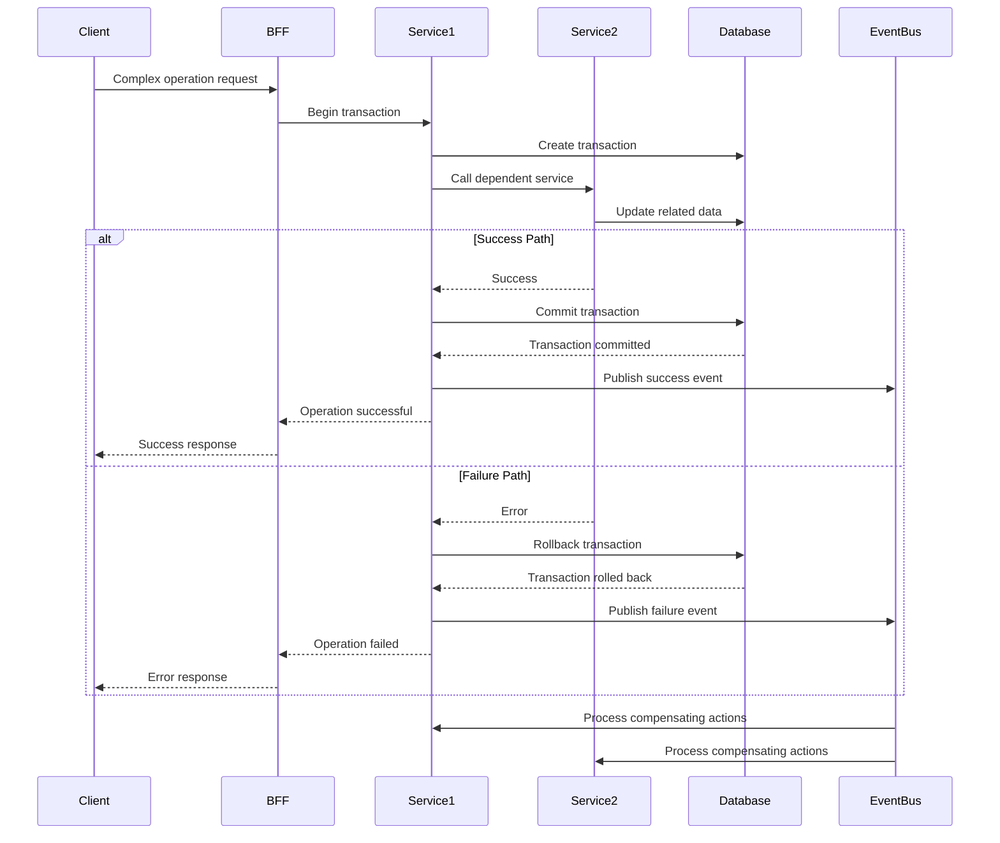
```mermaid
sequenceDiagram
    participant Client
    participant BFF
    participant Service1
    participant Service2
    participant Database
    participant EventBus

    Client->>BFF: Complex operation request
    BFF->>Service1: Begin transaction
    Service1->>Database: Create transaction
    
    Service1->>Service2: Call dependent service
    Service2->>Database: Update related data
    
    alt Success Path
        Service2-->>Service1: Success
        Service1->>Database: Commit transaction
        Database-->>Service1: Transaction committed
        Service1->>EventBus: Publish success event
        Service1-->>BFF: Operation successful
        BFF-->>Client: Success response
    else Failure Path
        Service2-->>Service1: Error
        Service1->>Database: Rollback transaction
        Database-->>Service1: Transaction rolled back
        Service1->>EventBus: Publish failure event
        Service1-->>BFF: Operation failed
        BFF-->>Client: Error response
    end
    
    EventBus->>Service1: Process compensating actions
    EventBus->>Service2: Process compensating actions
```

---

## **Performance Optimization Flow**

### **Caching Strategy**

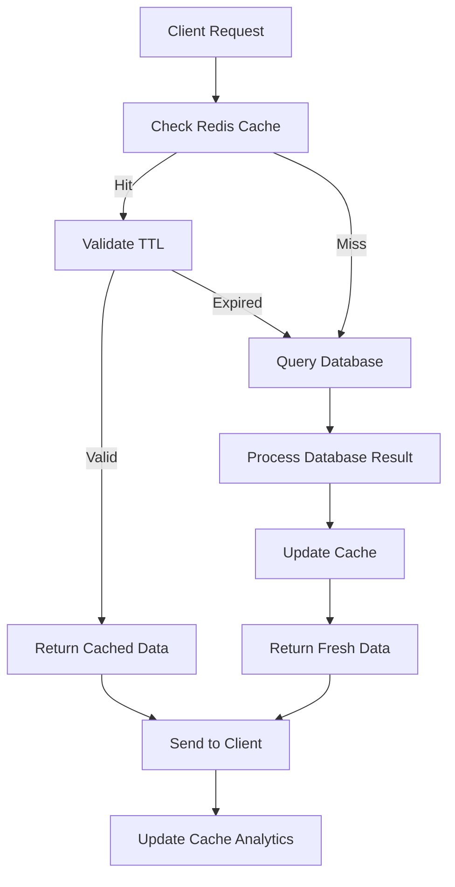
```mermaid
graph TD
    REQUEST[Client Request] --> CACHE_CHECK[Check Redis Cache]
    
    CACHE_CHECK -->|Hit| VALIDATE_TTL[Validate TTL]
    CACHE_CHECK -->|Miss| DATABASE[Query Database]
    
    VALIDATE_TTL -->|Valid| RETURN_CACHED[Return Cached Data]
    VALIDATE_TTL -->|Expired| DATABASE
    
    DATABASE --> PROCESS[Process Database Result]
    PROCESS --> UPDATE_CACHE[Update Cache]
    UPDATE_CACHE --> RETURN_FRESH[Return Fresh Data]
    
    RETURN_CACHED --> CLIENT[Send to Client]
    RETURN_FRESH --> CLIENT
    
    CLIENT --> ANALYTICS[Update Cache Analytics]
```

### **Load Balancing & Scaling**

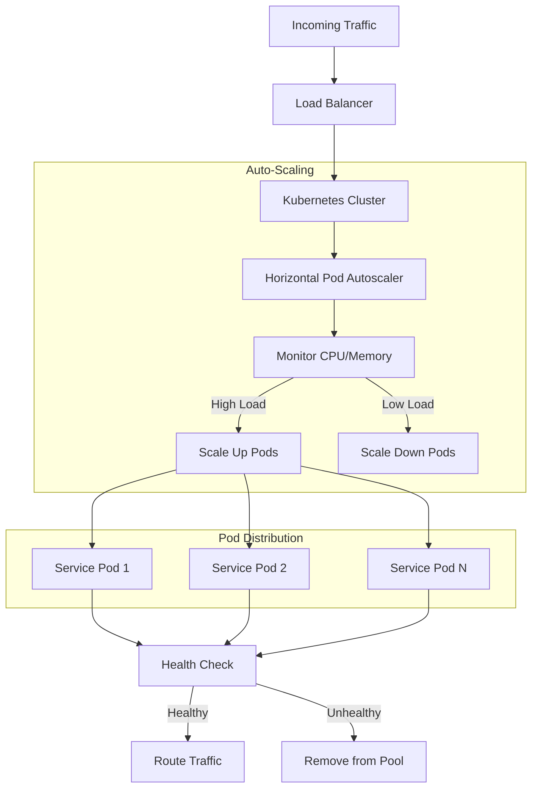
```mermaid
graph TD
    TRAFFIC[Incoming Traffic] --> LB[Load Balancer]
    
    LB --> K8S[Kubernetes Cluster]
    
    subgraph "Auto-Scaling"
        K8S --> HPA[Horizontal Pod Autoscaler]
        HPA --> METRICS[Monitor CPU/Memory]
        METRICS -->|High Load| SCALE_UP[Scale Up Pods]
        METRICS -->|Low Load| SCALE_DOWN[Scale Down Pods]
    end
    
    subgraph "Pod Distribution"
        SCALE_UP --> POD1[Service Pod 1]
        SCALE_UP --> POD2[Service Pod 2]
        SCALE_UP --> POD3[Service Pod N]
    end
    
    POD1 --> HEALTH[Health Check]
    POD2 --> HEALTH
    POD3 --> HEALTH
    
    HEALTH -->|Healthy| ROUTE[Route Traffic]
    HEALTH -->|Unhealthy| REMOVE[Remove from Pool]
```

---

This comprehensive flowchart documentation provides a clear visual representation of the system architecture, user journeys, data flows, and operational procedures for the health tech platform.
