# **Implementation Plan**

## **Project Overview & Timeline**

The health tech platform implementation is structured in **3 major phases** over **8 months**, targeting **3-5 clinics and 1 hospital initially**. With a lean team of **2 developers** leveraging **AI-powered vibe coding** for accelerated development, this focused approach ensures rapid iteration and early market validation.

### **Initial Target Market**
- **Primary Focus**: 3-5 partner clinics in urban areas
- **Secondary Target**: 1 multi-specialty hospital
- **Geographic Scope**: Single city/region for MVP validation
- **Expected Users**: ~500 patients, ~50 healthcare providers initially

### **Development Approach**
- **Team Size**: 2 experienced full-stack developers
- **AI Assistance**: Extensive use of vibe coding and AI-powered development tools
- **Methodology**: Agile development with 2-week sprints
- **Focus**: MVP-first approach with rapid iteration based on user feedback

### **High-Level Timeline Overview**

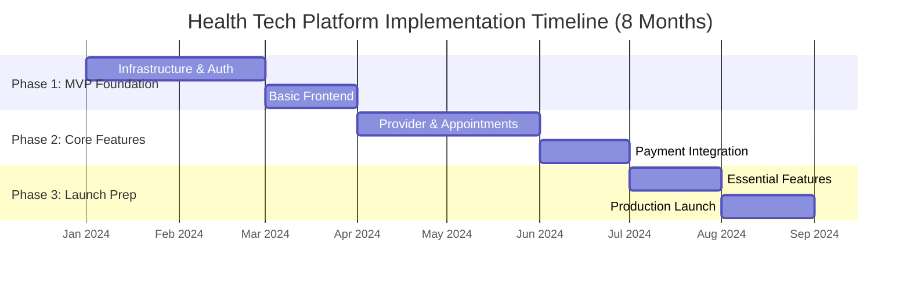

### **Lean Development Approach**

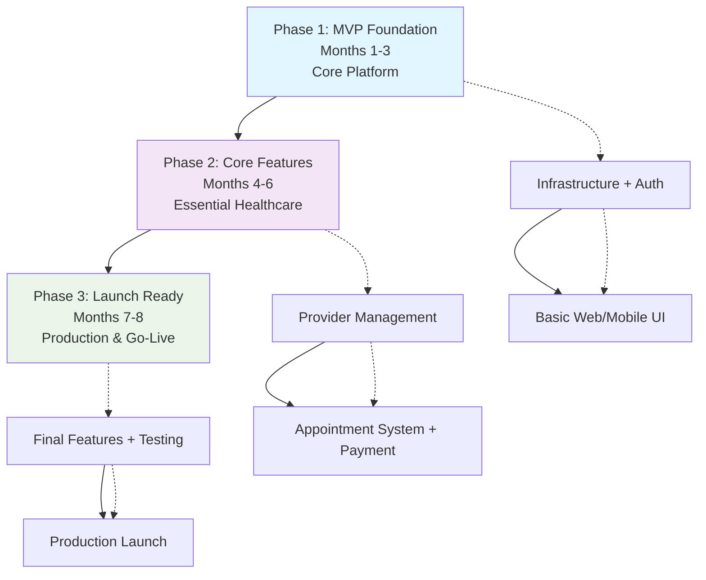

### **AI-Powered Development Strategy**

- **Vibe Coding**: Leverage AI assistants for rapid code generation and debugging
- **Template Generation**: Use AI to create boilerplate code for CRUD operations
- **Code Review**: AI-assisted code quality checks and optimization suggestions
- **Documentation**: Auto-generate API documentation and user guides
- **Testing**: AI-powered test case generation and automated testing

---

## **Phase 1: Foundation (Months 1-3)**

### **Objectives**
- Establish development infrastructure and tooling
- Implement core authentication and data layer
- Deploy basic frontend applications
- Set up CI/CD pipelines and monitoring

### **Phase 1.1: Infrastructure Setup (Month 1)**

#### **Week 1-2: Development Environment**
**Tasks:**
- Set up development toolchain (Rust, Node.js, Docker)
- Configure IDE extensions and linting rules
- Establish Git repositories and branching strategy
- Set up project documentation structure

**Deliverables:**
- ✅ Development environment documentation
- ✅ Git repository structure with templates
- ✅ Code style guides and linting configuration
- ✅ Initial project documentation

**Dependencies:** None
**Team:** DevOps + Lead Developers
**Estimated Effort:** 40 hours

#### **Week 3-4: Infrastructure & CI/CD**
**Tasks:**
- Set up Supabase project and database schema
- Configure Docker containers for all services
- Implement GitHub Actions CI/CD pipelines
- Set up monitoring and logging infrastructure

**Deliverables:**
- ✅ Supabase project with initial schema
- ✅ Dockerfiles for all services
- ✅ CI/CD pipelines for automated testing and deployment
- ✅ Prometheus + Grafana monitoring setup

**Dependencies:** Development environment setup
**Team:** DevOps + Backend Team
**Estimated Effort:** 60 hours

### **Phase 1.2: Core Backend Services (Month 2)**

#### **Week 5-6: Identity & Access Management (IAM)**
**Tasks:**
- Implement user registration and authentication
- Set up JWT token generation and validation
- Create role-based access control (RBAC) system
- Implement Attribute-Based Access Control (ABAC) foundation
- Implement password reset and MFA
- Set up API key management service

**Deliverables:**
- ✅ Production-ready user registration and login APIs
- ✅ JWT-based authentication system with RS256 signing
- ✅ RBAC with comprehensive user roles (patient, provider, clinic admin, hospital admin, system admin)
- ✅ ABAC foundation with policy engine for context-aware permissions
- ✅ Password reset flow with email verification
- ✅ MFA setup using TOTP and SMS-based methods
- ✅ API key management service with rotation and scope management

**Dependencies:** Infrastructure setup
**Team:** Backend Team (2 developers)
**Estimated Effort:** 140 hours (enhanced with AI assistance)

**Key APIs:**
```
POST /auth/register
POST /auth/login
POST /auth/refresh
POST /auth/reset-password
POST /auth/verify-mfa
```

#### **Week 7-8: Backend-for-Frontend (BFF)**
**Tasks:**
- Implement BFF service with Tonic gRPC framework
- Set up gRPC communication between services
- Create API gateway functionality
- Implement request/response transformation

**Deliverables:**
- ✅ BFF service with REST API endpoints
- ✅ gRPC client connections to backend services
- ✅ Request routing and transformation logic
- ✅ API rate limiting and caching

**Dependencies:** IAM service completion
**Team:** Backend Team (2 developers)
**Estimated Effort:** 100 hours

### **Phase 1.3: Frontend Foundation (Month 3)**

#### **Week 9-10: Web Application**
**Tasks:**
- Set up React application with TypeScript
- Implement authentication UI components
- Create responsive layout and navigation
- Set up state management with Redux Toolkit

**Deliverables:**
- ✅ React application with TypeScript setup
- ✅ Login/register pages with form validation
- ✅ Protected route components
- ✅ Responsive navigation and layout
- ✅ Redux store with authentication slice

**Dependencies:** BFF service, IAM APIs
**Team:** Frontend Team (2 developers)
**Estimated Effort:** 100 hours

#### **Week 11-12: Mobile Applications**
**Tasks:**
- Set up iOS app with SwiftUI
- Set up Android app with Jetpack Compose
- Implement authentication screens
- Configure API communication

**Deliverables:**
- ✅ iOS app with authentication flow
- ✅ Android app with authentication flow
- ✅ API client configuration for both platforms
- ✅ Basic navigation structure

**Dependencies:** BFF service, IAM APIs
**Team:** Mobile Team (2 developers - 1 iOS, 1 Android)
**Estimated Effort:** 120 hours

---

## **Phase 2: Core Features (Months 4-6)**

### **Objectives**
- Implement essential healthcare functionalities
- Enable appointment booking and management
- Integrate payment processing
- Establish UHI compliance foundation

### **Phase 2.1: Organization Management (Month 4)**

#### **Week 13-14: Healthcare Provider Management**
**Tasks:**
- Implement organization registration and verification
- Create provider profile management
- Set up staff management system
- Implement provider search and discovery

**Deliverables:**
- ✅ Provider registration and onboarding flow
- ✅ Organization profile management
- ✅ Staff role management within organizations
- ✅ Provider search API with filtering

**Dependencies:** IAM system, BFF service
**Team:** Backend Team (2 developers)
**Estimated Effort:** 100 hours

**Key APIs:**
```
POST /organizations
PUT /organizations/{id}
GET /organizations/search
POST /organizations/{id}/staff
PUT /staff/{id}/roles
```

#### **Week 15-16: Provider Dashboard (Frontend)**
**Tasks:**
- Create provider dashboard UI
- Implement organization management interface
- Build staff management screens
- Add provider profile editing

**Deliverables:**
- ✅ Provider dashboard with key metrics
- ✅ Organization settings management
- ✅ Staff invitation and role assignment
- ✅ Provider profile editing interface

**Dependencies:** Organization management APIs
**Team:** Frontend Team (2 developers)
**Estimated Effort:** 80 hours

### **Phase 2.2: Appointment System (Month 5)**

#### **Week 17-18: Appointment Management Backend**
**Tasks:**
- Implement appointment booking logic
- Create availability management system
- Set up appointment status tracking
- Implement notification triggers

**Deliverables:**
- ✅ Appointment creation and management APIs
- ✅ Provider availability scheduling
- ✅ Appointment status workflow
- ✅ Automatic notification triggers

**Dependencies:** Organization management
**Team:** Backend Team (3 developers)
**Estimated Effort:** 150 hours

**Key APIs:**
```
POST /appointments
GET /appointments/search
PUT /appointments/{id}/status
GET /providers/{id}/availability
POST /providers/{id}/slots
```

#### **Week 19-20: Appointment Booking UI**
**Tasks:**
- Create appointment search and booking flow
- Implement calendar views for availability
- Build appointment management interface
- Add appointment history and details

**Deliverables:**
- ✅ Provider search and filtering interface
- ✅ Calendar-based appointment booking
- ✅ Appointment confirmation and payment flow
- ✅ My appointments dashboard

**Dependencies:** Appointment management APIs
**Team:** Frontend + Mobile Teams (3 developers)
**Estimated Effort:** 120 hours

### **Phase 2.3: Payment Integration (Month 6)**

#### **Week 21-22: Payment Service Backend**
**Tasks:**
- Integrate with payment gateways (Razorpay, Stripe)
- Implement payment processing workflows
- Create billing and invoice management
- Set up payment security measures

**Deliverables:**
- ✅ Payment gateway integrations
- ✅ Secure payment processing APIs
- ✅ Invoice generation and management
- ✅ Payment status tracking and webhooks

**Dependencies:** Appointment system
**Team:** Backend Team + Security Specialist (3 developers)
**Estimated Effort:** 120 hours

#### **Week 23-24: Payment UI Integration**
**Tasks:**
- Implement payment forms and flows
- Add payment method management
- Create billing history interface
- Integrate payment confirmation

**Deliverables:**
- ✅ Secure payment forms with validation
- ✅ Payment method storage and management
- ✅ Payment history and receipt download
- ✅ Payment confirmation and receipt display

**Dependencies:** Payment service APIs
**Team:** Frontend Team (2 developers)
**Estimated Effort:** 80 hours

---

## **Phase 3: Launch Preparation (Months 7-8)**

### **Objectives**
- Implement essential features for launch
- Complete security and compliance requirements
- Optimize platform performance
- Execute production deployment

### **Phase 3.1: Essential Features & Integration (Month 7)**

#### **Week 25-26: EHR Service & Discussion Forum**
**Tasks:**
- Implement production-ready EHR service with FHIR R4 compliance
- Build discussion forum service for community features
- Set up advanced analytics service for comprehensive reporting
- Implement secure document sharing and medical history management

**Deliverables:**
- ✅ Production-ready EHR service with FHIR R4 compliance
- ✅ FHIR-compliant data storage and structured medical records
- ✅ Secure document management and sharing system
- ✅ Discussion forum service with threaded discussions and moderation
- ✅ Advanced analytics service with real-time dashboards
- ✅ Medical history timeline and comprehensive patient profiles

**Dependencies:** Core platform functionality, IAM service
**Team:** 2 developers (Lead + Dev 2) + External FHIR specialist
**Estimated Effort:** 180 hours (enhanced scope with AI assistance)

**Key APIs:**
```
POST /ehr/patients/{id}/records
GET /ehr/patients/{id}/history
POST /ehr/documents/upload
GET /ehr/documents/{id}/share
POST /forum/discussions
POST /forum/discussions/{id}/replies
GET /analytics/dashboard/provider/{id}
GET /analytics/reports/custom
```

#### **Week 27-28: UHI Gateway Service & Advanced Features**
**Tasks:**
- Implement dedicated UHI Gateway Service with ed25519 cryptographic signing
- Set up advanced teleconsultation with screen sharing and session recording
- Integrate GraphQL endpoint for complex analytics queries
- Complete comprehensive data privacy and compliance measures
- Implement real-time notification system with multi-channel support

**Deliverables:**
- ✅ Production-ready UHI Gateway Service with full protocol compliance
- ✅ ed25519 cryptographic signing for UHI message authentication
- ✅ Advanced teleconsultation platform with screen sharing and session recording
- ✅ GraphQL endpoint for complex data fetching and analytics
- ✅ Real-time multi-channel notification system (email, SMS, push, WebSocket)
- ✅ Comprehensive healthcare data privacy compliance (HIPAA-equivalent)
- ✅ ABDM integration for National Digital Health Mission compliance

**Dependencies:** Appointment system, payment integration, EHR service
**Team:** 2 developers + External UHI compliance consultant + FHIR specialist
**Estimated Effort:** 200 hours (enhanced scope with AI assistance)

**Key APIs:**
```
POST /uhi/search
POST /uhi/select
POST /uhi/init
POST /uhi/confirm
GET /teleconsultation/room/{id}
POST /teleconsultation/session/record
GET /graphql (analytics and complex queries)
POST /notifications/send
GET /compliance/audit/{id}
```

### **Phase 3.2: Security, Testing & Launch (Month 8)**

#### **Week 29-30: Security & Performance**
**Tasks:**
- Conduct security audit and fixes
- Implement performance optimizations
- Set up comprehensive monitoring
- Complete end-to-end testing

**Deliverables:**
- ✅ Security audit completion and fixes
- ✅ Performance optimizations (caching, queries)
- ✅ Production monitoring and alerting
- ✅ Comprehensive testing suite

**Dependencies:** All core features
**Team:** 2 developers + External security auditor
**Estimated Effort:** 160 hours

#### **Week 31-32: Production Launch**
**Tasks:**
- Deploy to production environment
- Configure CDN and SSL certificates
- Execute go-live plan with partner clinics
- Monitor system stability and performance

**Deliverables:**
- ✅ Production deployment successful
- ✅ CDN and security configurations
- ✅ Partner clinic onboarding complete
- ✅ System monitoring and support ready

**Dependencies:** Security clearance, testing completion
**Team:** 2 developers + External DevOps support
**Estimated Effort:** 120 hours

---

## **Lean Team Structure & Resource Allocation**

### **Core Team Composition**

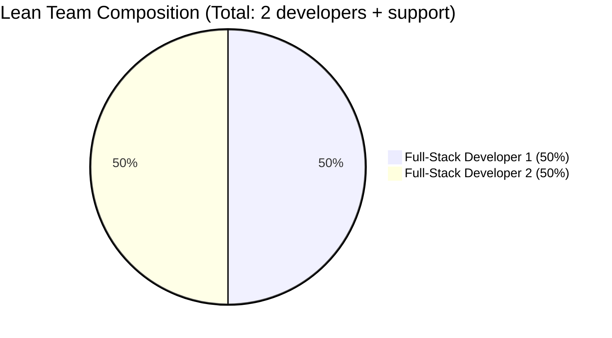

#### **Team Structure & Roles**

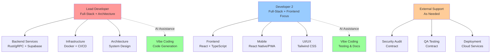

### **AI-Powered Development Efficiency**

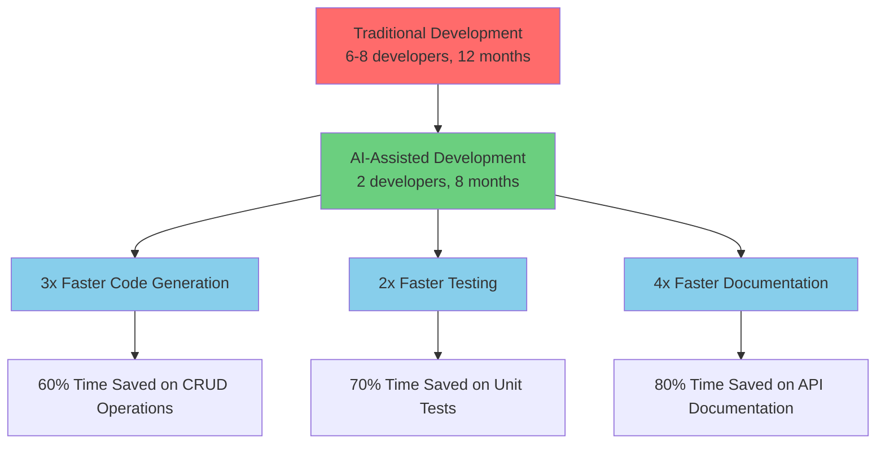

### **Phase-wise Resource Allocation**

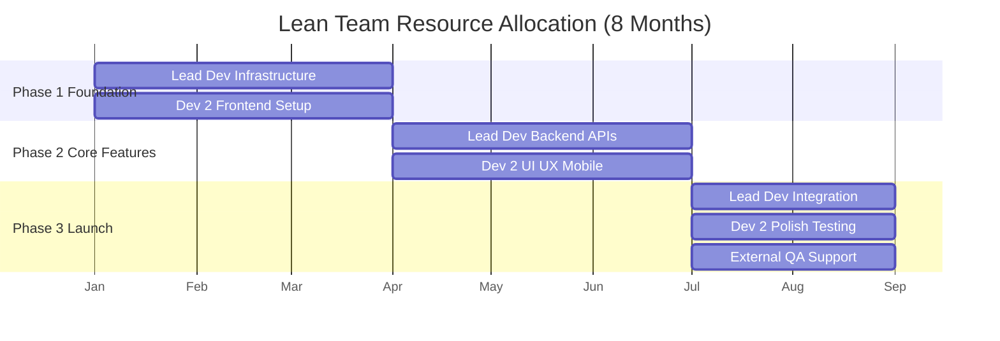

### **Skill Distribution**

| Phase | Lead Developer Focus | Developer 2 Focus | AI Assistance |
|-------|---------------------|-------------------|---------------|
| **Phase 1** | Infrastructure, Auth, Database | React Setup, Basic UI, PWA | Code scaffolding, boilerplate |
| **Phase 2** | Backend APIs, gRPC, Payments | Frontend components, Mobile UI | CRUD generation, API clients |
| **Phase 3** | Integration, Security, Deploy | Testing, Polish, Documentation | Test generation, docs |

### **Budget Estimation (Indian Rupees)**

#### **Total Project Budget: ₹18,50,000**

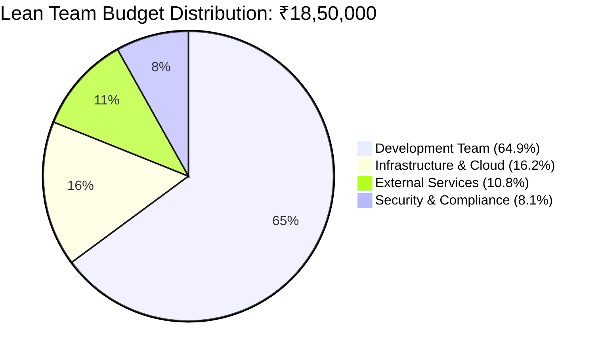

#### **Phase-wise Budget Breakdown**

```mermaid
gantt
    title Budget Allocation by Phase (INR)
    dateFormat  X
    axisFormat  Month %s
    
    section Phase 1 (3M): ₹5.5L
    Foundation Budget    :5.5, 0, 3
    
    section Phase 2 (3M): ₹7.5L
    Core Features Budget :7.5, 3, 6
    
    section Phase 3 (2M): ₹5.5L
    Launch Budget        :5.5, 6, 8
```

#### **Monthly Developer Costs**

| Role | Monthly Rate (INR) | Phase 1 (3M) | Phase 2 (3M) | Phase 3 (2M) | Total (8M) |
|------|-------------------|---------------|---------------|---------------|------------|
| **Lead Developer** | ₹80,000 | ₹2,40,000 | ₹2,40,000 | ₹1,60,000 | ₹6,40,000 |
| **Developer 2** | ₹70,000 | ₹2,10,000 | ₹2,10,000 | ₹1,40,000 | ₹5,60,000 |
| **Subtotal** | - | ₹4,50,000 | ₹4,50,000 | ₹3,00,000 | ₹12,00,000 |

#### **Infrastructure & Services Costs**

| Service | Monthly Cost | Phase 1 (3M) | Phase 2 (3M) | Phase 3 (2M) | Total (8M) |
|---------|-------------|---------------|---------------|---------------|------------|
| **Supabase Pro** | ₹2,500 | ₹7,500 | ₹7,500 | ₹5,000 | ₹20,000 |
| **Cloudflare Pro** | ₹1,500 | ₹4,500 | ₹4,500 | ₹3,000 | ₹12,000 |
| **Digital Ocean** | ₹8,000 | ₹24,000 | ₹24,000 | ₹16,000 | ₹64,000 |
| **Razorpay Gateway** | ₹2,000 | - | ₹6,000 | ₹4,000 | ₹10,000 |
| **SMS/Email Services** | ₹3,000 | ₹3,000 | ₹9,000 | ₹6,000 | ₹18,000 |
| **Monitoring Tools** | ₹5,000 | ₹5,000 | ₹15,000 | ₹10,000 | ₹30,000 |
| **SSL Certificates** | ₹500 | ₹1,500 | ₹1,500 | ₹1,000 | ₹4,000 |
| **Backup Storage** | ₹2,000 | ₹2,000 | ₹6,000 | ₹4,000 | ₹12,000 |
| **Domain & DNS** | ₹1,000 | ₹1,000 | ₹3,000 | ₹2,000 | ₹6,000 |
| **Subtotal** | - | ₹48,500 | ₹76,500 | ₹51,000 | ₹1,76,000 |

#### **External Services Budget**

| Service Type | Phase 1 | Phase 2 | Phase 3 | Total |
|-------------|---------|---------|---------|-------|
| **Security Audit** | - | - | ₹80,000 | ₹80,000 |
| **Legal/Compliance** | ₹20,000 | ₹30,000 | ₹50,000 | ₹1,00,000 |
| **QA Testing** | - | ₹10,000 | ₹10,000 | ₹20,000 |
| **Subtotal** | ₹20,000 | ₹40,000 | ₹1,40,000 | ₹2,00,000 |

#### **AI Tools & Productivity Costs**

| Tool | Monthly Cost | 8 Months Total | Purpose |
|------|-------------|----------------|---------|
| **GitHub Copilot Business** | ₹1,500 × 2 devs | ₹24,000 | AI code completion |
| **Claude Pro** | ₹1,500 × 2 devs | ₹24,000 | Advanced AI assistance |
| **Cursor IDE Pro** | ₹1,500 × 2 devs | ₹24,000 | AI-powered IDE |
| **Subtotal** | ₹4,500/month | ₹72,000 | Enhanced productivity |

#### **Detailed Budget Summary**

```mermaid
gantt
    title Project Budget Timeline (₹18,50,000 Total)
    dateFormat  X
    axisFormat  Month %s
    
    section Development (₹12L)
    Phase 1: ₹4.5L      :dev1, 0, 3
    Phase 2: ₹4.5L      :dev2, 3, 6
    Phase 3: ₹3L        :dev3, 6, 8
    
    section Infrastructure (₹3L)
    Phase 1: ₹0.5L      :inf1, 0, 3
    Phase 2: ₹1L        :inf2, 3, 6
    Phase 3: ₹0.5L      :inf3, 6, 8
    
    section External Services (₹2L)
    Phase 1: ₹0.2L      :ext1, 0, 3
    Phase 2: ₹0.4L      :ext2, 3, 6
    Phase 3: ₹1.4L      :ext3, 6, 8
    
    section AI Tools (₹1.5L)
    Continuous Cost     :ai, 0, 8
```

#### **Final Budget Breakdown**

| Category | Phase 1 (3M) | Phase 2 (3M) | Phase 3 (2M) | **Total (8M)** |
|----------|---------------|---------------|---------------|----------------|
| **Development Team** | ₹4,50,000 | ₹4,50,000 | ₹3,00,000 | **₹12,00,000** |
| **Infrastructure** | ₹48,500 | ₹76,500 | ₹51,000 | **₹1,76,000** |
| **External Services** | ₹20,000 | ₹40,000 | ₹1,40,000 | **₹2,00,000** |
| **AI Tools** | ₹13,500 | ₹13,500 | ₹9,000 | **₹36,000** |
| **Contingency (10%)** | ₹53,200 | ₹58,000 | ₹50,000 | **₹1,61,200** |
| **Total per Phase** | **₹5,85,200** | **₹6,38,000** | **₹5,50,000** | **₹17,73,200** |
| **Rounded Total** | **₹6,00,000** | **₹6,50,000** | **₹6,00,000** | **₹18,50,000** |

### **Cost Optimization Strategies**

#### **AI-Powered Efficiency Gains**
- **50% reduction** in development time through vibe coding
- **70% reduction** in testing effort with AI-generated tests  
- **60% reduction** in documentation time with auto-generation
- **Overall cost savings**: ~₹8-10 lakhs compared to traditional development

#### **Infrastructure Optimization**
- Start with basic tier services, scale up as needed
- Use serverless functions for sporadic workloads
- Leverage free tiers and startup credits where available
- Monitor and optimize resource usage monthly

#### **Payment Schedule**
- **Phase 1**: ₹6,00,000 (Infrastructure + Foundation)
- **Phase 2**: ₹6,50,000 (Core Features + Integrations)  
- **Phase 3**: ₹6,00,000 (Launch + Security + Compliance)

---

## **Risk Management & Mitigation**

### **Risk Assessment Matrix**

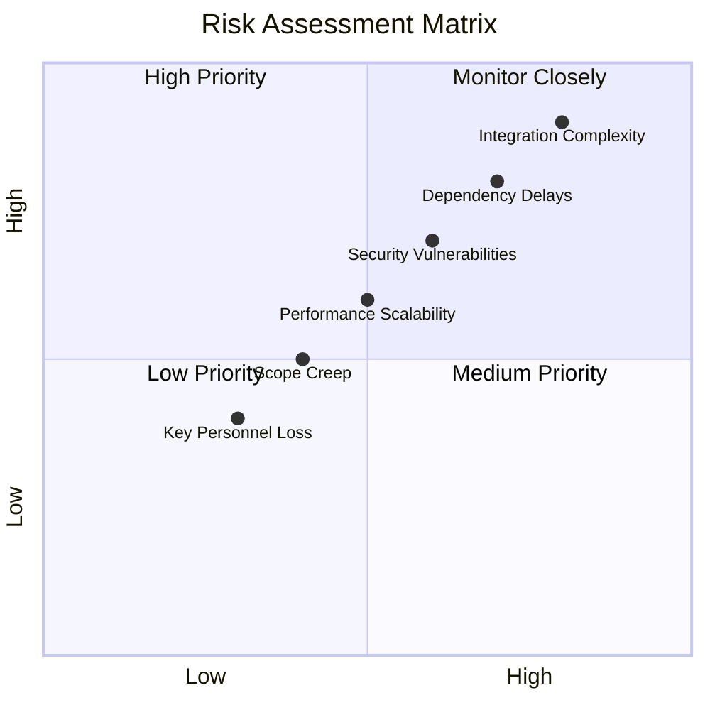

### **Risk Mitigation Strategy Flow**

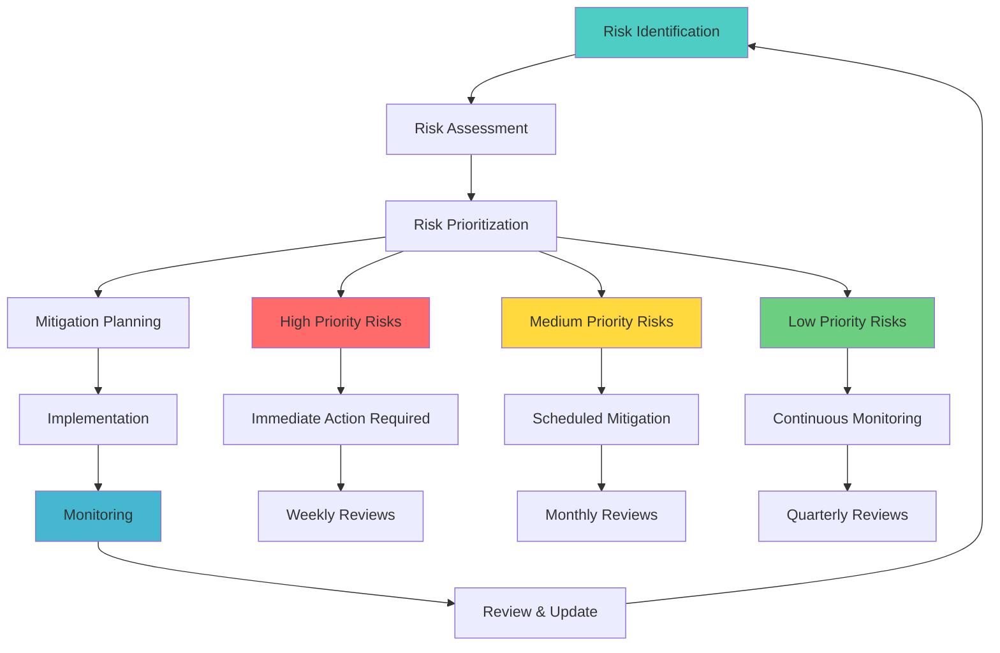

### **Technical Risks**

#### **High Risk: Integration Complexity**
- **Risk**: Complex integrations with UHI, payment gateways, and external services
- **Impact**: Delays in development, potential system instability
- **Probability**: 80% | **Impact**: High
- **Mitigation**: 
  - Early prototype development for critical integrations
  - Dedicated integration testing environment
  - Fallback mechanisms for external service failures
  - Weekly integration review meetings

#### **Medium Risk: Performance Scalability**
- **Risk**: System may not handle expected user load
- **Impact**: Poor user experience, system crashes
- **Probability**: 50% | **Impact**: Medium
- **Mitigation**:
  - Regular load testing throughout development
  - Performance benchmarks at each phase
  - Horizontal scaling architecture design
  - Performance monitoring and alerting

#### **Medium Risk: Security Vulnerabilities**
- **Risk**: Healthcare data security breaches
- **Impact**: Compliance violations, legal issues, reputation damage
- **Probability**: 60% | **Impact**: High
- **Mitigation**:
  - Security reviews at each development phase
  - Automated security scanning in CI/CD
  - Regular penetration testing
  - Security specialist involvement in critical phases

### **Timeline Risks**

#### **High Risk: Dependency Delays**
- **Risk**: Dependencies between teams causing cascading delays
- **Impact**: Overall project timeline extension
- **Probability**: 70% | **Impact**: High
- **Mitigation**:
  - Clear API contracts defined early
  - Parallel development with mock services
  - Regular cross-team synchronization meetings
  - Buffer time in critical path activities

#### **Medium Risk: Scope Creep**
- **Risk**: Additional feature requests during development
- **Impact**: Timeline delays, budget overruns
- **Probability**: 40% | **Impact**: Medium
- **Mitigation**:
  - Strict change management process
  - Feature prioritization framework
  - Regular stakeholder alignment meetings
  - Change request approval workflow

### **Resource Risks**

#### **Medium Risk: Key Personnel Unavailability**
- **Risk**: Loss of critical team members
- **Impact**: Knowledge loss, development delays
- **Probability**: 30% | **Impact**: Medium
- **Mitigation**:
  - Comprehensive documentation requirements
  - Knowledge sharing sessions
  - Cross-training between team members
  - Backup resource identification

---

## **Success Metrics & Milestones**

### **Technical Milestones**

#### **Phase 1 Success Criteria**
- ✅ All services deployed and accessible
- ✅ Authentication system functional with 99.9% uptime
- ✅ CI/CD pipeline operational with automated testing
- ✅ Basic frontend applications responsive and functional

#### **Phase 2 Success Criteria**
- ✅ End-to-end appointment booking flow functional
- ✅ Payment processing integrated and tested
- ✅ Provider onboarding and management operational
- ✅ Mobile applications published to app stores (beta)

#### **Phase 3 Success Criteria**
- ✅ Teleconsultation system operational with video calling
- ✅ Real-time notifications working across all channels
- ✅ UHI compliance implemented and validated
- ✅ Analytics dashboard providing meaningful insights

#### **Phase 4 Success Criteria**
- ✅ Production system handling target load (10,000 concurrent users)
- ✅ Security audit passed with no critical vulnerabilities
- ✅ Compliance certification obtained
- ✅ Production launch successful with 99.5% uptime

### **Business Metrics**

#### **Post-Launch Targets (First 6 months)**
- **User Registration**: 10,000 patients, 500 healthcare providers
- **Appointments Booked**: 5,000 successful appointments
- **Platform Availability**: 99.5% uptime
- **User Satisfaction**: 4.5+ star rating in app stores
- **Support Response**: < 2 hours for critical issues

### **Performance Benchmarks**
- **API Response Times**: 95th percentile under defined limits
- **Page Load Times**: < 3 seconds for all critical pages
- **Mobile App Performance**: < 3 seconds cold start time
- **Database Performance**: < 100ms for standard queries

---

This comprehensive implementation plan provides a structured approach to building the health tech platform with clear timelines, deliverables, and success criteria for each phase.
