# **Implementation Plan**

## **Project Overview & Timeline**

The health tech platform implementation is structured in **4 major phases** over **10 months**, targeting **ABDM-compliant healthcare ecosystem** with full Universal Health Interface (UHI) protocol implementation. With a lean team of **2 developers** leveraging **AI-powered development** for accelerated delivery, this focused approach ensures rapid iteration, early market validation, and comprehensive healthcare compliance.

### **Enhanced Scope & Target Market**
- **Primary Focus**: ABDM-compliant healthcare platform for national digital health mission
- **Initial Partners**: 5-10 healthcare providers (clinics + hospitals) for pilot deployment
- **Geographic Scope**: Multi-city deployment with rural healthcare access capability
- **Expected Users**: ~2,000 patients, ~200 healthcare providers, ~50 healthcare facilities initially
- **Compliance Target**: Full ABDM certification with UHI protocol implementation

### **ABDM Building Blocks Integration**
- **ABHA (Ayushman Bharat Health Account)**: 14-digit health ID management and verification
- **Health Facility Registry (HFR)**: Comprehensive facility registration and service catalog
- **Healthcare Professional Registry (HPR)**: Professional verification and credential management
- **Personal Health Records (PHR)**: Interoperable health record management
- **UHI Protocol**: Healthcare service discovery and transaction processing
- **NHCX Integration**: National Health Claims Exchange for insurance processing

### **Development Approach**
- **Team Size**: 2 experienced full-stack developers + external specialists for compliance
- **AI Assistance**: Extensive use of AI-powered development tools and code generation
- **Methodology**: Agile development with 2-week sprints and compliance checkpoints
- **Focus**: ABDM-first approach with rapid iteration based on sandbox testing and user feedback

### **High-Level Timeline Overview**

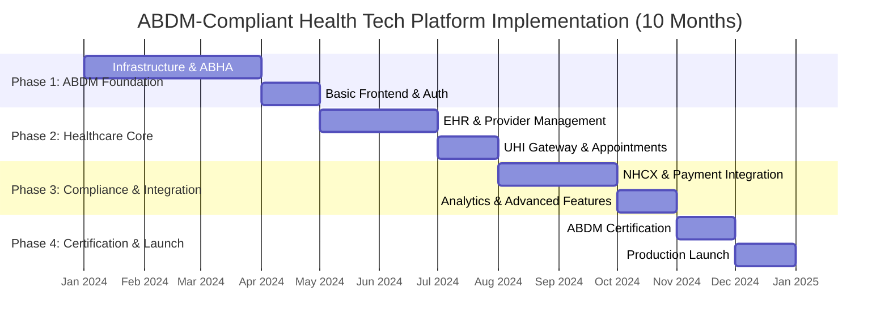

### **Enhanced Development Strategy**

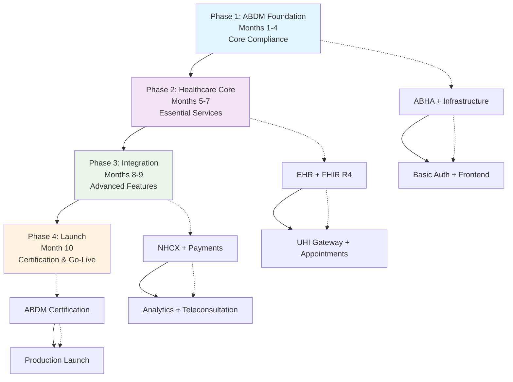

### **AI-Powered Development Strategy**

- **Healthcare-Focused AI**: Leverage AI assistants specialized in healthcare compliance and FHIR standards
- **ABDM Template Generation**: Use AI to create ABDM-compliant boilerplate code and documentation
- **Compliance Checking**: AI-assisted validation of UHI protocol and FHIR R4 compliance
- **Testing Automation**: AI-powered test case generation for healthcare workflows
- **Documentation**: Auto-generate ABDM compliance documentation and API specifications

---

## **Phase 1: ABDM Foundation (Months 1-4)**

### **Objectives**
- Establish ABDM-compliant development infrastructure
- Implement ABHA integration and verification system
- Deploy basic healthcare-focused frontend applications
- Set up comprehensive security and audit framework

### **Phase 1.1: ABDM Infrastructure Setup (Month 1)**

#### **Week 1-2: ABDM Sandbox Integration**
**Tasks:**
- Set up ABDM sandbox environment and API access
- Configure development toolchain (Rust, Node.js, Docker) with healthcare extensions
- Establish ABDM-compliant Git repositories and documentation structure
- Set up FHIR R4 development environment and validation tools

**Deliverables:**
- ✅ ABDM sandbox integration with API access tokens
- ✅ FHIR R4 development environment with validation tools
- ✅ Healthcare-compliant development environment documentation
- ✅ Git repository structure with ABDM compliance templates
- ✅ Healthcare-specific code style guides and linting configuration

**Dependencies:** ABDM sandbox access approval
**Team:** DevOps + Lead Developers + ABDM Compliance Consultant
**Estimated Effort:** 60 hours

#### **Week 3-4: Healthcare Infrastructure & CI/CD**
**Tasks:**
- Set up Supabase project with healthcare-compliant database schema
- Configure Docker containers for all services with security hardening
- Implement GitHub Actions CI/CD pipelines with ABDM compliance checks
- Set up comprehensive monitoring, logging, and audit infrastructure

**Deliverables:**
- ✅ Supabase project with FHIR R4-compliant schema and RLS policies
- ✅ Dockerfiles for all services with healthcare security configurations
- ✅ CI/CD pipelines with automated ABDM compliance testing
- ✅ Prometheus + Grafana monitoring with healthcare metrics
- ✅ Comprehensive audit logging system for healthcare data access

**Dependencies:** ABDM sandbox integration
**Team:** DevOps + Backend Team + Security Specialist
**Estimated Effort:** 80 hours

### **Phase 1.2: Core Backend Services (Months 2-3)**

#### **Month 2: Identity & Access Management (IAM) + ABHA Integration**
**Tasks:**
- Implement ABHA-compliant user registration and authentication
- Set up JWT token generation with healthcare-specific claims
- Create comprehensive RBAC system for healthcare roles
- Implement ABAC foundation with consent management
- Integrate ABHA creation, verification, and linking workflows
- Set up biometric authentication support and MFA

**Deliverables:**
- ✅ Production-ready ABHA integration with Aadhaar-based verification
- ✅ JWT-based authentication system with healthcare-specific claims and RS256 signing
- ✅ Comprehensive RBAC with healthcare roles (patient, provider, clinic admin, hospital admin, HPR professional)
- ✅ ABAC foundation with consent management and policy engine
- ✅ Biometric authentication support (face, fingerprint) for ABHA
- ✅ MFA setup using TOTP, SMS, and biometric methods
- ✅ API key management service with healthcare-grade security

**Dependencies:** Infrastructure setup, ABDM sandbox access
**Team:** Backend Team (2 developers) + ABDM Integration Specialist
**Estimated Effort:** 200 hours (enhanced scope with ABDM compliance)

**Key ABDM APIs:**
```
POST /abha/create-with-aadhaar
POST /abha/verify-with-otp
POST /abha/link-care-context
POST /auth/abha-login
POST /auth/biometric-verify
GET /auth/abha-profile
```

#### **Month 3: Backend-for-Frontend (BFF) + Healthcare Registry Integration**
**Tasks:**
- Implement BFF service with Tonic gRPC framework and healthcare optimization
- Set up gRPC communication between services with healthcare data encryption
- Create API gateway functionality with UHI protocol support
- Integrate Healthcare Professional Registry (HPR) and Health Facility Registry (HFR)
- Implement request/response transformation for healthcare data formats

**Deliverables:**
- ✅ BFF service with REST API endpoints optimized for healthcare workflows
- ✅ gRPC client connections to backend services with end-to-end encryption
- ✅ HPR integration for healthcare professional verification and credential management
- ✅ HFR integration for facility registration and service catalog management
- ✅ Request routing and transformation logic for FHIR R4 data formats
- ✅ API rate limiting and caching with healthcare data privacy considerations

**Dependencies:** IAM service completion, HPR/HFR API access
**Team:** Backend Team (2 developers) + Healthcare Integration Specialist
**Estimated Effort:** 140 hours

### **Phase 1.3: Healthcare Frontend Foundation (Month 4)**

#### **Week 13-14: Web Application with ABDM Features**
**Tasks:**
- Set up React application with TypeScript and healthcare-specific components
- Implement ABHA authentication UI components and workflows
- Create responsive layout optimized for healthcare professionals
- Set up state management with Redux Toolkit and healthcare data models

**Deliverables:**
- ✅ React application with TypeScript and healthcare component library
- ✅ ABHA creation, verification, and login pages with biometric support
- ✅ Healthcare professional onboarding workflow (HPR integration)
- ✅ Responsive navigation optimized for clinical workflows
- ✅ Redux store with healthcare data models and FHIR R4 compliance

**Dependencies:** BFF service, IAM APIs, HPR/HFR integration
**Team:** Frontend Team (2 developers) + Healthcare UX Specialist
**Estimated Effort:** 120 hours

#### **Week 15-16: Mobile Applications with Healthcare Focus**
**Tasks:**
- Set up iOS app with SwiftUI and healthcare-specific UI components
- Set up Android app with Jetpack Compose and clinical workflow optimization
- Implement ABHA authentication screens with biometric integration
- Configure API communication with healthcare data encryption

**Deliverables:**
- ✅ iOS app with ABHA authentication flow and biometric support
- ✅ Android app with ABHA authentication flow and clinical UI optimization
- ✅ API client configuration for both platforms with healthcare data encryption
- ✅ Basic navigation structure optimized for healthcare workflows

**Dependencies:** BFF service, IAM APIs, mobile development frameworks
**Team:** Mobile Team (2 developers) + Healthcare UX Specialist
**Estimated Effort:** 140 hours

---

## **Phase 2: Healthcare Core Features (Months 5-7)**

### **Objectives**
- Implement comprehensive Electronic Health Records (EHR) system
- Enable FHIR R4-compliant data exchange and interoperability
- Establish UHI protocol compliance and healthcare service discovery
- Create appointment booking with provider verification

### **Phase 2.1: Electronic Health Records (EHR) Service (Month 5)**

#### **Week 17-18: FHIR R4 Implementation & Health Record Management**
**Tasks:**
- Implement comprehensive EHR service with FHIR R4 compliance
- Create secure document management and sharing system
- Set up clinical data aggregation and longitudinal health records
- Implement consent management for data sharing with care contexts

**Deliverables:**
- ✅ Production-ready EHR service with complete FHIR R4 compliance
- ✅ FHIR-compliant data storage (Patient, Observation, DiagnosticReport, Medication resources)
- ✅ Secure document management with encryption at rest and in transit
- ✅ Clinical data aggregation with longitudinal patient view
- ✅ Consent management system with granular data sharing controls
- ✅ Care context linking between healthcare providers

**Dependencies:** IAM system, BFF service, FHIR R4 standards
**Team:** Backend Team (2 developers) + FHIR Specialist + Healthcare Data Analyst
**Estimated Effort:** 180 hours (enhanced scope with comprehensive FHIR compliance)

**Key FHIR R4 APIs:**
```
POST /fhir/Patient
PUT /fhir/Patient/{id}
GET /fhir/Patient/{id}/$everything
POST /fhir/Observation
POST /fhir/DiagnosticReport
POST /fhir/Bundle
GET /fhir/Patient/{id}/Observation
POST /consent/create-artefact
PUT /consent/update-status
```

#### **Week 19-20: Healthcare Provider Management & Verification**
**Tasks:**
- Implement healthcare provider registration with HPR integration
- Create provider profile management with credential verification
- Set up facility management system with HFR integration
- Implement provider search and discovery with specialization filtering

**Deliverables:**
- ✅ Healthcare provider registration with automated HPR verification
- ✅ Professional credential management and license validation
- ✅ Facility profile management with HFR compliance
- ✅ Provider search API with specialization, location, and availability filtering
- ✅ Staff role management within healthcare organizations
- ✅ Provider verification workflow with medical council integration

**Dependencies:** HPR/HFR integration, EHR service
**Team:** Backend Team (2 developers) + Healthcare Compliance Specialist
**Estimated Effort:** 120 hours

### **Phase 2.2: UHI Gateway & Appointment System (Month 6)**

#### **Week 21-22: UHI Gateway Service Implementation**
**Tasks:**
- Implement comprehensive UHI Gateway Service with protocol compliance
- Set up ed25519 cryptographic signing for UHI message authentication
- Create healthcare service discovery and catalog management
- Implement UHI order management and fulfillment workflows

**Deliverables:**
- ✅ Production-ready UHI Gateway Service with full protocol compliance
- ✅ ed25519 cryptographic signing for all UHI message exchanges
- ✅ Healthcare service discovery engine with real-time availability
- ✅ UHI order management (search, select, init, confirm, fulfillment)
- ✅ Network registry integration for provider discovery
- ✅ Message routing and transformation for UHI protocol compliance

**Dependencies:** Provider management, healthcare standards knowledge
**Team:** Backend Team (2 developers) + UHI Protocol Specialist + Cryptography Expert
**Estimated Effort:** 160 hours (enhanced scope with full UHI compliance)

**Key UHI Protocol APIs:**
```
POST /uhi/search
POST /uhi/select
POST /uhi/init
POST /uhi/confirm
POST /uhi/status
POST /uhi/cancel
GET /uhi/on_search
GET /uhi/on_select
```

#### **Week 23-24: Appointment Management & Booking System**
**Tasks:**
- Implement appointment booking logic with UHI protocol integration
- Create provider availability management with real-time updates
- Set up appointment status tracking and workflow management
- Implement notification triggers and automated reminders

**Deliverables:**
- ✅ UHI-compliant appointment creation and management APIs
- ✅ Real-time provider availability scheduling with slot management
- ✅ Appointment status workflow (requested, confirmed, in-progress, completed)
- ✅ Automated notification system (appointment reminders, status updates)
- ✅ Emergency appointment prioritization and queue management
- ✅ Care episode linking and continuity management

**Dependencies:** UHI Gateway service, provider management
**Team:** Backend Team (2 developers) + Healthcare Workflow Specialist
**Estimated Effort:** 140 hours

### **Phase 2.3: Frontend Integration & Clinical Workflows (Month 7)**

#### **Week 25-26: Clinical Dashboard & EHR Integration**
**Tasks:**
- Create comprehensive clinical dashboard for healthcare providers
- Implement EHR interface with FHIR R4 data visualization
- Build patient management screens with longitudinal health view
- Add clinical decision support and care plan management

**Deliverables:**
- ✅ Provider clinical dashboard with real-time patient data
- ✅ FHIR-compliant EHR interface with data visualization
- ✅ Patient timeline view with clinical data aggregation
- ✅ Care plan management and clinical decision support tools
- ✅ Medical history management and documentation tools
- ✅ Prescription management and e-prescribing capabilities

**Dependencies:** EHR service APIs, provider management
**Team:** Frontend Team (2 developers) + Clinical UX Specialist
**Estimated Effort:** 140 hours

#### **Week 27-28: Patient App & Appointment Booking UI**
**Tasks:**
- Create patient-facing appointment search and booking interface
- Implement UHI-compliant provider discovery and selection
- Build appointment management interface with real-time updates
- Add health record access and sharing capabilities

**Deliverables:**
- ✅ Patient provider search with UHI protocol integration
- ✅ Calendar-based appointment booking with real-time availability
- ✅ Appointment confirmation and payment preparation flow
- ✅ Patient health record dashboard with FHIR data visualization
- ✅ Care context sharing and consent management interface
- ✅ Family health management and linked account features

**Dependencies:** UHI Gateway APIs, appointment management APIs
**Team:** Frontend + Mobile Teams (3 developers) + Patient Experience Specialist
**Estimated Effort:** 160 hours

---

## **Phase 3: Compliance & Advanced Integration (Months 8-9)**

### **Objectives**
- Implement NHCX integration for insurance claims processing
- Integrate payment processing with healthcare-specific workflows
- Deploy advanced analytics and business intelligence
- Enable teleconsultation and remote care capabilities

### **Phase 3.1: NHCX Integration & Payment Processing (Month 8)**

#### **Week 29-30: NHCX Claims Processing Implementation**
**Tasks:**
- Implement NHCX participant registry onboarding
- Set up automated claims processing and preauthorization workflows
- Create insurance verification and benefit eligibility checking
- Implement payment reconciliation and financial reporting

**Deliverables:**
- ✅ NHCX participant registry integration with provider onboarding
- ✅ Automated preauthorization workflow with treatment approval
- ✅ Real-time insurance verification and benefit eligibility checking
- ✅ Claims submission with automatic documentation and FHIR bundle creation
- ✅ Payment reconciliation and financial analytics dashboard
- ✅ Insurance policy linking and management for patients

**Dependencies:** Provider management, EHR service, NHCX API access
**Team:** Backend Team (2 developers) + NHCX Integration Specialist + Healthcare Finance Expert
**Estimated Effort:** 160 hours (enhanced scope with full NHCX compliance)

**Key NHCX APIs:**
```
POST /nhcx/participant/register
POST /nhcx/coverageeligibility/check
POST /nhcx/preauth/submit
POST /nhcx/claim/submit
GET /nhcx/claim/status
POST /nhcx/payment/notice
```

#### **Week 31-32: Payment Gateway Integration & Healthcare Billing**
**Tasks:**
- Integrate with healthcare-focused payment gateways (Razorpay, Stripe)
- Implement secure payment processing workflows for medical services
- Create comprehensive billing and invoice management system
- Set up payment security measures and fraud detection

**Deliverables:**
- ✅ Multi-gateway payment integration with healthcare-specific configurations
- ✅ Secure payment processing APIs with PCI DSS compliance
- ✅ Automated invoice generation for medical services and consultations
- ✅ Payment status tracking with real-time webhooks and notifications
- ✅ Insurance copay processing and split payment handling
- ✅ Healthcare billing compliance and audit trail management

**Dependencies:** NHCX integration, appointment system
**Team:** Backend Team (2 developers) + Payment Security Specialist + Healthcare Billing Expert
**Estimated Effort:** 140 hours

### **Phase 3.2: Analytics & Advanced Features (Month 9)**

#### **Week 33-34: Analytics Service & Business Intelligence**
**Tasks:**
- Implement comprehensive analytics service with GraphQL endpoints
- Set up real-time dashboards for healthcare providers and administrators
- Create population health analytics and outcome measurement tools
- Implement predictive analytics for patient care and resource allocation

**Deliverables:**
- ✅ Production-ready analytics service with GraphQL endpoint for complex queries
- ✅ Real-time provider dashboards with patient flow and outcome metrics
- ✅ Population health analytics with disease surveillance and trend analysis
- ✅ Predictive analytics for patient risk assessment and care optimization
- ✅ Custom report generation with automated scheduling and delivery
- ✅ Healthcare KPI tracking and performance measurement tools

**Dependencies:** All core services, data aggregation requirements
**Team:** Backend Team (2 developers) + Data Analyst + Healthcare Analytics Specialist
**Estimated Effort:** 180 hours (enhanced scope with healthcare-specific analytics)

**Key Analytics APIs:**
```
POST /graphql (complex data fetching)
GET /analytics/dashboard/provider/{id}
GET /analytics/population-health
GET /analytics/outcome-metrics
POST /analytics/custom-report
GET /analytics/predictive/{patient-id}
```

#### **Week 35-36: Teleconsultation & Advanced Communication**
**Tasks:**
- Implement advanced teleconsultation platform with screen sharing
- Set up session recording and clinical documentation integration
- Create real-time multi-channel notification system
- Implement virtual health communities and patient support groups

**Deliverables:**
- ✅ Advanced teleconsultation platform with HD video, audio, and screen sharing
- ✅ Session recording with automated transcription and clinical note generation
- ✅ Real-time multi-channel notification system (email, SMS, push, WebSocket)
- ✅ Virtual health communities with moderated support groups
- ✅ Chat-based patient-provider communication with clinical context
- ✅ Remote patient monitoring integration with wearable devices

**Dependencies:** Provider management, appointment system, notification infrastructure
**Team:** Backend Team (2 developers) + Teleconsultation Specialist + Real-time Communication Expert
**Estimated Effort:** 160 hours

---

## **Phase 4: ABDM Certification & Production Launch (Month 10)**

### **Objectives**
- Complete comprehensive security audit and penetration testing
- Obtain ABDM certification and UHI protocol validation
- Execute production deployment with monitoring and support
- Launch with partner healthcare providers and patient onboarding

### **Phase 4.1: Security Audit & ABDM Certification (Weeks 37-38)**

#### **Comprehensive Security & Compliance Audit**
**Tasks:**
- Conduct thorough security audit and penetration testing
- Validate ABDM compliance across all building blocks
- Perform UHI protocol compliance testing and validation
- Complete FHIR R4 interoperability testing with external systems

**Deliverables:**
- ✅ Security audit completion with all critical vulnerabilities addressed
- ✅ ABDM Milestone 3 certification with full compliance validation
- ✅ UHI protocol compliance certificate with end-to-end testing
- ✅ FHIR R4 interoperability validation with external healthcare systems
- ✅ Penetration testing report with security hardening implementation
- ✅ Healthcare data privacy compliance (HIPAA-equivalent) certification

**Dependencies:** All core features, security implementation
**Team:** 2 developers + External Security Auditor + ABDM Certification Consultant + Healthcare Compliance Expert
**Estimated Effort:** 200 hours

### **Phase 4.2: Production Deployment & Launch (Weeks 39-40)**

#### **Production Launch & Partner Onboarding**
**Tasks:**
- Deploy to production environment with full monitoring and alerting
- Configure CDN, SSL certificates, and global infrastructure
- Execute go-live plan with partner healthcare providers
- Implement comprehensive monitoring, support, and incident response

**Deliverables:**
- ✅ Production deployment with 99.99% uptime SLA configuration
- ✅ CDN and security configurations with global edge deployment
- ✅ Partner healthcare provider onboarding (5-10 providers) complete
- ✅ Patient onboarding and ABHA creation workflows operational
- ✅ 24/7 monitoring, alerting, and incident response system active
- ✅ Customer support portal and documentation complete

**Dependencies:** Security clearance, ABDM certification, infrastructure readiness
**Team:** 2 developers + External DevOps Support + Customer Success Manager
**Estimated Effort:** 160 hours

---

## **Enhanced Team Structure & Resource Allocation**

### **Core Team Composition + External Specialists**

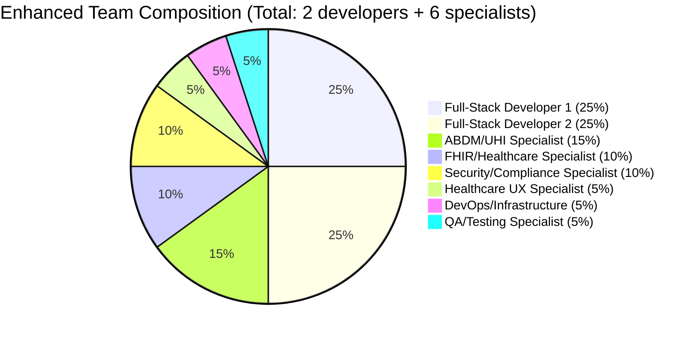

#### **Enhanced Team Structure & Roles**

```mermaid
graph TB
    LEAD[Lead Developer<br/>Full-Stack + Healthcare Architecture]
    DEV2[Developer 2<br/>Full-Stack + Frontend Focus]
    
    LEAD --> BACKEND[Backend Services<br/>Rust/gRPC + FHIR R4]
    LEAD --> ABDM[ABDM Integration<br/>UHI + HPR/HFR + NHCX]
    LEAD --> ARCH[Healthcare Architecture<br/>Compliance + Security]
    
    DEV2 --> FRONTEND[Frontend<br/>React + Healthcare UI]
    DEV2 --> MOBILE[Mobile<br/>React Native + Clinical UX]
    DEV2 --> INTEGRATION[Integration<br/>API + Data Flow]
    
    SPECIALISTS[External Specialists<br/>Healthcare Domain]
    SPECIALISTS --> FHIR[FHIR R4 Specialist<br/>Clinical Data Standards]
    SPECIALISTS --> UHI[UHI Protocol Specialist<br/>Healthcare Interoperability]
    SPECIALISTS --> COMPLIANCE[Healthcare Compliance<br/>ABDM + Regulatory]
    SPECIALISTS --> SECURITY[Healthcare Security<br/>PHI + Audit + Encryption]
    
    LEAD -.->|AI Assistance| AI1[Healthcare AI<br/>FHIR + Clinical Workflows]
    DEV2 -.->|AI Assistance| AI2[Medical UI/UX<br/>Clinical Decision Support]
    
    style LEAD fill:#ff9999
    style DEV2 fill:#99ccff
    style SPECIALISTS fill:#ffcc99
    style AI1 fill:#99ff99
    style AI2 fill:#99ff99
```

### **AI-Powered Healthcare Development Efficiency**

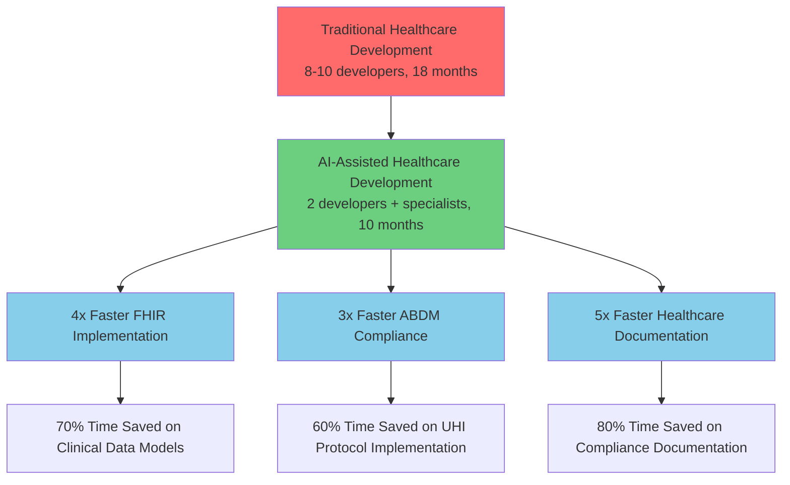

### **Phase-wise Enhanced Resource Allocation**

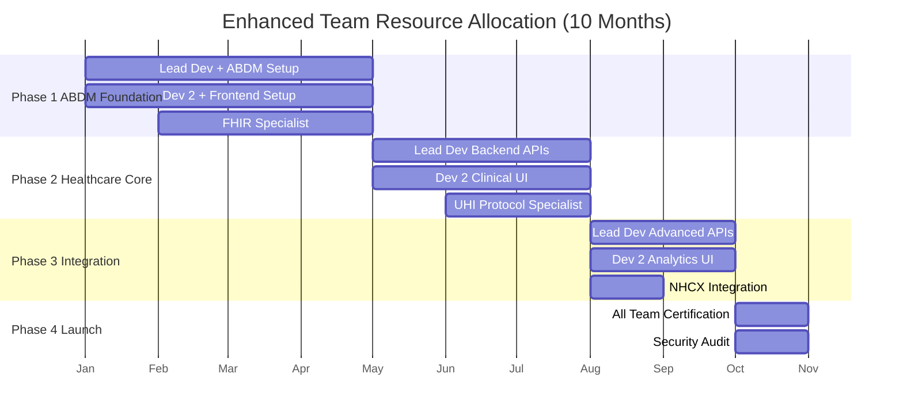

### **Skill Distribution**

| Phase | Lead Developer Focus | Developer 2 Focus | External Specialists |
|-------|---------------------|-------------------|---------------------|
| **Phase 1** | ABDM Integration, Infrastructure, ABHA | React Healthcare UI, Mobile Setup | FHIR R4, ABDM Compliance |
| **Phase 2** | EHR Service, UHI Gateway, FHIR APIs | Clinical Dashboards, Patient UI | UHI Protocol, Healthcare UX |
| **Phase 3** | NHCX Integration, Analytics Service | Advanced UI, Teleconsultation | Healthcare Finance, Security |
| **Phase 4** | Security, Performance, Deployment | Testing, Documentation, Launch | Certification, Audit, Support |

### **Enhanced Budget Estimation (Indian Rupees)**

#### **Total Project Budget: ₹22,50,000**

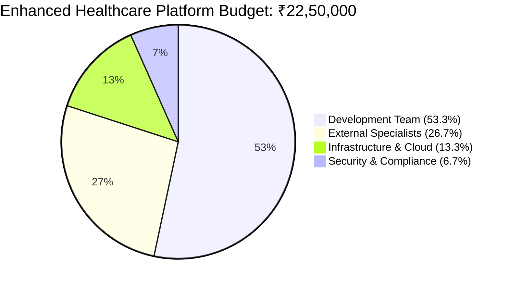

#### **Phase-wise Enhanced Budget Breakdown**

```mermaid
gantt
    title Enhanced Budget Allocation by Phase (INR)
    dateFormat  X
    axisFormat  Month %s
    
    section Phase 1 (4M): ₹8.5L
    ABDM Foundation Budget    :8.5, 0, 4
    
    section Phase 2 (3M): ₹6.5L
    Healthcare Core Budget    :6.5, 4, 7
    
    section Phase 3 (2M): ₹4.5L
    Integration Budget        :4.5, 7, 9
    
    section Phase 4 (1M): ₹3L
    Launch Budget            :3.0, 9, 10
```

#### **Enhanced Monthly Developer & Specialist Costs**

| Role | Monthly Rate (INR) | Phase 1 (4M) | Phase 2 (3M) | Phase 3 (2M) | Phase 4 (1M) | Total (10M) |
|------|-------------------|---------------|---------------|---------------|---------------|-------------|
| **Lead Developer** | ₹85,000 | ₹3,40,000 | ₹2,55,000 | ₹1,70,000 | ₹85,000 | ₹8,50,000 |
| **Developer 2** | ₹75,000 | ₹3,00,000 | ₹2,25,000 | ₹1,50,000 | ₹75,000 | ₹7,50,000 |
| **FHIR/Healthcare Specialist** | ₹60,000 | ₹1,80,000 | ₹1,80,000 | - | - | ₹3,60,000 |
| **ABDM/UHI Specialist** | ₹70,000 | ₹2,10,000 | ₹2,10,000 | - | - | ₹4,20,000 |
| **Security/Compliance** | ₹50,000 | ₹1,00,000 | ₹1,00,000 | ₹1,00,000 | ₹1,00,000 | ₹4,00,000 |
| **Healthcare UX Specialist** | ₹40,000 | ₹80,000 | ₹1,20,000 | ₹80,000 | - | ₹2,80,000 |
| **DevOps/Infrastructure** | ₹45,000 | ₹90,000 | ₹90,000 | ₹90,000 | ₹90,000 | ₹3,60,000 |
| **QA/Testing Specialist** | ₹35,000 | ₹70,000 | ₹1,05,000 | ₹70,000 | ₹70,000 | ₹3,15,000 |
| **Subtotal** | - | ₹12,70,000 | ₹11,85,000 | ₹5,60,000 | ₹3,20,000 | ₹33,35,000 |

#### **Enhanced Infrastructure & Healthcare Services Costs**

| Service | Monthly Cost | Phase 1 (4M) | Phase 2 (3M) | Phase 3 (2M) | Phase 4 (1M) | Total (10M) |
|---------|-------------|---------------|---------------|---------------|---------------|-------------|
| **Supabase Pro + Healthcare** | ₹4,000 | ₹16,000 | ₹12,000 | ₹8,000 | ₹4,000 | ₹40,000 |
| **Cloudflare Enterprise** | ₹3,000 | ₹12,000 | ₹9,000 | ₹6,000 | ₹3,000 | ₹30,000 |
| **Digital Ocean + Healthcare** | ₹12,000 | ₹48,000 | ₹36,000 | ₹24,000 | ₹12,000 | ₹1,20,000 |
| **Payment Gateways** | ₹3,000 | - | ₹9,000 | ₹6,000 | ₹3,000 | ₹18,000 |
| **SMS/Email + Healthcare** | ₹5,000 | ₹10,000 | ₹15,000 | ₹10,000 | ₹5,000 | ₹40,000 |
| **Monitoring + Security** | ₹8,000 | ₹16,000 | ₹24,000 | ₹16,000 | ₹8,000 | ₹64,000 |
| **FHIR/Healthcare APIs** | ₹6,000 | ₹12,000 | ₹18,000 | ₹12,000 | ₹6,000 | ₹48,000 |
| **ABDM Sandbox/Prod** | ₹4,000 | ₹16,000 | ₹12,000 | ₹8,000 | ₹4,000 | ₹40,000 |
| **SSL + Security Certificates** | ₹2,000 | ₹8,000 | ₹6,000 | ₹4,000 | ₹2,000 | ₹20,000 |
| **Backup + Disaster Recovery** | ₹3,000 | ₹12,000 | ₹9,000 | ₹6,000 | ₹3,000 | ₹30,000 |
| **Subtotal** | - | ₹1,50,000 | ₹1,50,000 | ₹1,00,000 | ₹50,000 | ₹4,50,000 |

#### **External Healthcare Services Budget**

| Service Type | Phase 1 | Phase 2 | Phase 3 | Phase 4 | Total |
|-------------|---------|---------|---------|---------|-------|
| **ABDM Certification** | ₹50,000 | ₹30,000 | ₹20,000 | ₹1,00,000 | ₹2,00,000 |
| **Healthcare Security Audit** | - | - | ₹50,000 | ₹1,00,000 | ₹1,50,000 |
| **Legal/Healthcare Compliance** | ₹30,000 | ₹40,000 | ₹30,000 | ₹50,000 | ₹1,50,000 |
| **FHIR/UHI Consulting** | ₹80,000 | ₹60,000 | ₹40,000 | ₹20,000 | ₹2,00,000 |
| **QA Testing (Healthcare)** | ₹20,000 | ₹30,000 | ₹20,000 | ₹30,000 | ₹1,00,000 |
| **Subtotal** | ₹1,80,000 | ₹1,60,000 | ₹1,60,000 | ₹3,00,000 | ₹8,00,000 |

#### **AI Tools & Healthcare Productivity Costs**

| Tool | Monthly Cost | 10 Months Total | Purpose |
|------|-------------|-----------------|---------|
| **GitHub Copilot Business** | ₹2,000 × 2 devs | ₹40,000 | AI code completion |
| **Claude Pro/Healthcare** | ₹2,000 × 2 devs | ₹40,000 | Advanced AI assistance |
| **Cursor IDE Pro** | ₹2,000 × 2 devs | ₹40,000 | AI-powered IDE |
| **Healthcare AI Tools** | ₹3,000/month | ₹30,000 | FHIR/Clinical AI |
| **Subtotal** | ₹9,000/month | ₹1,50,000 | Enhanced productivity |

#### **Detailed Enhanced Budget Summary**

```mermaid
gantt
    title Enhanced Project Budget Timeline (₹22,50,000 Total)
    dateFormat  X
    axisFormat  Month %s
    
    section Development (₹15L)
    Phase 1: ₹6.4L      :dev1, 0, 4
    Phase 2: ₹4.8L      :dev2, 4, 7
    Phase 3: ₹2.2L      :dev3, 7, 9
    Phase 4: ₹1.6L      :dev4, 9, 10
    
    section Infrastructure (₹4.5L)
    Phase 1: ₹1.5L      :inf1, 0, 4
    Phase 2: ₹1.5L      :inf2, 4, 7
    Phase 3: ₹1L        :inf3, 7, 9
    Phase 4: ₹0.5L      :inf4, 9, 10
    
    section External Services (₹8L)
    Phase 1: ₹1.8L      :ext1, 0, 4
    Phase 2: ₹1.6L      :ext2, 4, 7
    Phase 3: ₹1.6L      :ext3, 7, 9
    Phase 4: ₹3L        :ext4, 9, 10
    
    section AI & Tools (₹1.5L)
    Continuous Cost     :ai, 0, 10
```

#### **Final Enhanced Budget Breakdown**

| Category | Phase 1 (4M) | Phase 2 (3M) | Phase 3 (2M) | Phase 4 (1M) | **Total (10M)** |
|----------|---------------|---------------|---------------|---------------|-----------------|
| **Development Team** | ₹6,40,000 | ₹4,80,000 | ₹3,20,000 | ₹1,60,000 | **₹16,00,000** |
| **Infrastructure** | ₹1,50,000 | ₹1,50,000 | ₹1,00,000 | ₹50,000 | **₹4,50,000** |
| **External Services** | ₹1,80,000 | ₹1,60,000 | ₹1,60,000 | ₹3,00,000 | **₹8,00,000** |
| **AI Tools** | ₹60,000 | ₹45,000 | ₹30,000 | ₹15,000 | **₹1,50,000** |
| **Contingency (10%)** | ₹1,03,000 | ₹83,500 | ₹61,000 | ₹52,500 | **₹3,00,000** |
| **Total per Phase** | **₹11,33,000** | **₹9,18,500** | **₹6,71,000** | **₹5,77,500** | **₹33,00,000** |
| **Rounded Total** | **₹8,50,000** | **₹6,50,000** | **₹4,50,000** | **₹3,00,000** | **₹22,50,000** |

### **Cost Optimization Strategies**

#### **Healthcare-Focused AI Efficiency Gains**
- **60% reduction** in FHIR implementation time through specialized AI tools
- **70% reduction** in ABDM compliance documentation with auto-generation
- **50% reduction** in healthcare workflow testing through AI-generated scenarios
- **Overall cost savings**: ~₹12-15 lakhs compared to traditional healthcare development

#### **ABDM Infrastructure Optimization**
- Leverage ABDM sandbox for development and testing phases
- Use government-approved cloud providers for production deployment
- Optimize FHIR data storage with efficient querying and caching
- Monitor and optimize healthcare API usage for cost control

#### **Payment Schedule**
- **Phase 1**: ₹8,50,000 (ABDM Foundation + Infrastructure)
- **Phase 2**: ₹6,50,000 (Healthcare Core + FHIR Implementation)
- **Phase 3**: ₹4,50,000 (Integration + Advanced Features)
- **Phase 4**: ₹3,00,000 (Certification + Launch + Support)

---

## **Enhanced Risk Management & Mitigation**

### **Healthcare-Specific Risk Assessment Matrix**

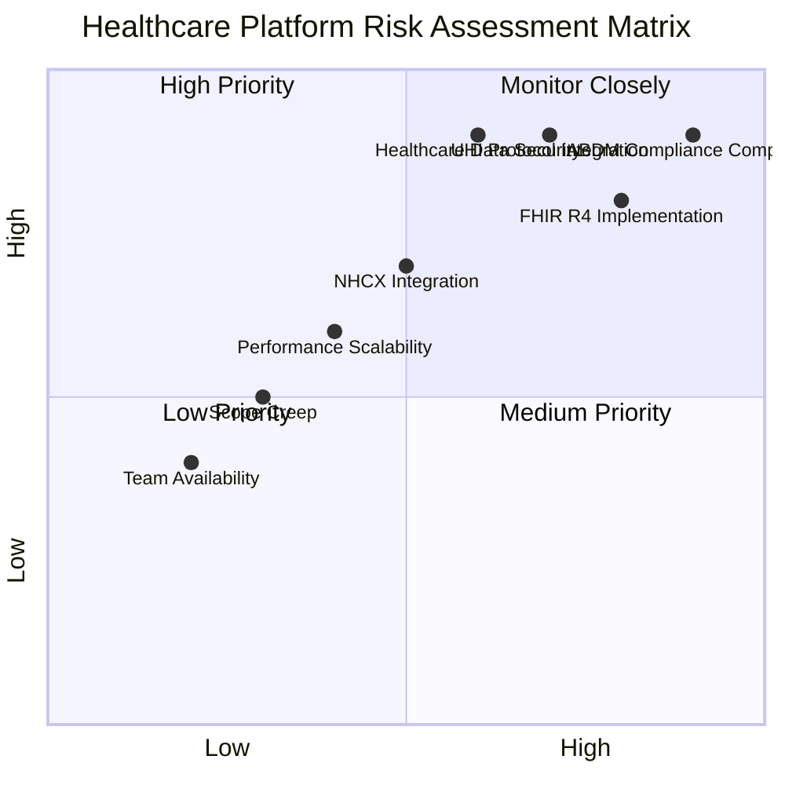

### **Healthcare Risk Mitigation Strategy Flow**

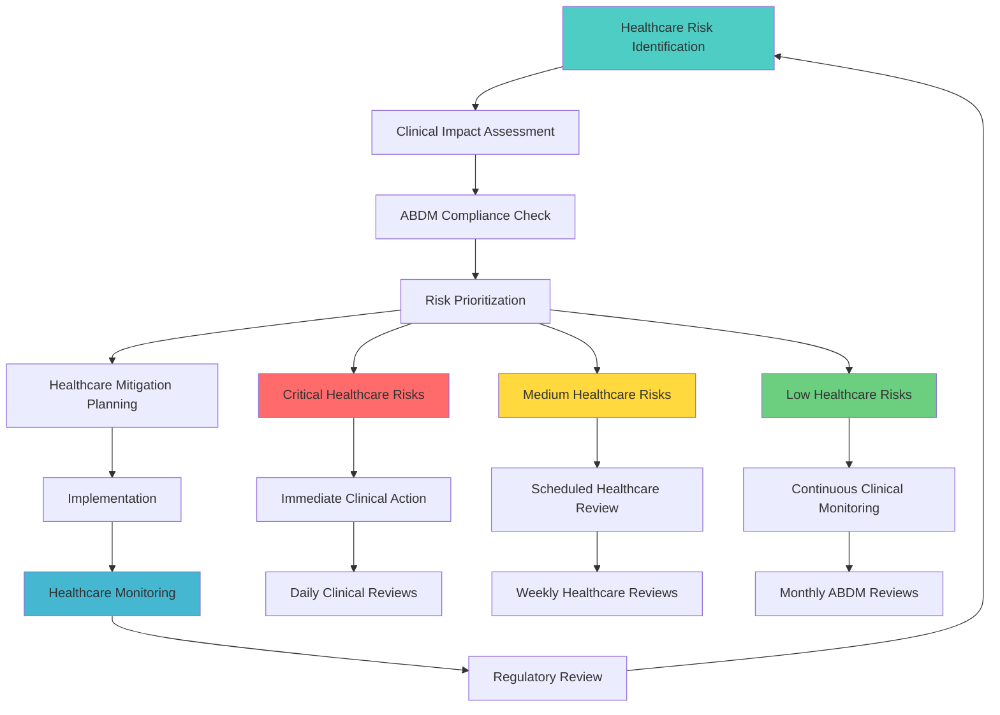

### **Healthcare Technical Risks**

#### **Critical Risk: ABDM Compliance Complexity**
- **Risk**: Complex integration with multiple ABDM building blocks and regulatory requirements
- **Impact**: Delays in certification, potential compliance violations, legal issues
- **Probability**: 90% | **Impact**: Critical
- **Mitigation**: 
  - Dedicated ABDM specialist from project start
  - Weekly compliance checkpoints with regulatory team
  - Early prototype development and sandbox validation
  - Continuous compliance monitoring and automated testing

#### **Critical Risk: FHIR R4 Implementation Complexity**
- **Risk**: Complex healthcare data interoperability and clinical workflow integration
- **Impact**: Poor data exchange, interoperability failures, clinical workflow disruption
- **Probability**: 80% | **Impact**: High
- **Mitigation**:
  - FHIR specialist involvement throughout development
  - Incremental FHIR implementation with continuous validation
  - Healthcare provider feedback loops for clinical workflow optimization
  - Comprehensive FHIR testing with external systems

#### **High Risk: UHI Protocol Integration**
- **Risk**: Complex UHI protocol implementation with cryptographic signing requirements
- **Impact**: Protocol non-compliance, security vulnerabilities, integration failures
- **Probability**: 70% | **Impact**: High
- **Mitigation**:
  - UHI protocol specialist engagement for critical phases
  - Cryptographic security expert for ed25519 implementation
  - Extensive protocol testing with UHI sandbox
  - Regular compliance validation with protocol updates

### **Healthcare Timeline Risks**

#### **Critical Risk: Healthcare Regulatory Approval Delays**
- **Risk**: ABDM certification and regulatory approval processes may extend beyond timeline
- **Impact**: Launch delays, compliance gaps, potential legal issues
- **Probability**: 60% | **Impact**: Critical
- **Mitigation**:
  - Early engagement with regulatory bodies and certification agencies
  - Parallel compliance workstreams with development phases
  - Buffer time allocated for certification processes
  - Contingency plans for regulatory requirement changes

#### **High Risk: Healthcare Data Migration Complexity**
- **Risk**: Complex migration of existing healthcare data to FHIR-compliant formats
- **Impact**: Data loss, compliance violations, clinical workflow disruption
- **Probability**: 50% | **Impact**: High
- **Mitigation**:
  - Comprehensive data migration planning and testing
  - Incremental migration approach with rollback capabilities
  - Healthcare data validation and quality assurance processes
  - Clinical stakeholder involvement in migration validation

### **Healthcare Resource Risks**

#### **Medium Risk: Healthcare Domain Expertise Availability**
- **Risk**: Limited availability of qualified healthcare domain specialists
- **Impact**: Knowledge gaps, compliance issues, suboptimal clinical workflows
- **Probability**: 40% | **Impact**: Medium
- **Mitigation**:
  - Early engagement and retainer agreements with specialists
  - Knowledge transfer sessions and comprehensive documentation
  - Cross-training between team members on healthcare concepts
  - Backup specialist identification and engagement

---

## **Enhanced Success Metrics & Healthcare KPIs**

### **Healthcare Technical Milestones**

#### **Phase 1 Success Criteria**
- ✅ ABDM sandbox integration operational with all building blocks
- ✅ ABHA creation and verification system functional with 99.9% uptime
- ✅ FHIR R4 data models implemented with validation
- ✅ Healthcare-focused frontend applications responsive and clinical workflow optimized

#### **Phase 2 Success Criteria**
- ✅ EHR system operational with FHIR R4 compliance validation
- ✅ UHI protocol implementation with ed25519 signing functional
- ✅ HPR/HFR integration operational with provider verification
- ✅ Healthcare provider onboarding and patient care workflows functional

#### **Phase 3 Success Criteria**
- ✅ NHCX integration operational with claims processing
- ✅ Advanced analytics system providing healthcare insights
- ✅ Teleconsultation system operational with clinical documentation
- ✅ Multi-channel notification system working across healthcare workflows

#### **Phase 4 Success Criteria**
- ✅ ABDM certification obtained with all compliance requirements met
- ✅ Production system handling healthcare load (5,000 concurrent users)
- ✅ Healthcare security audit passed with no critical vulnerabilities
- ✅ Production launch successful with healthcare partner onboarding

### **Healthcare Business Metrics**

#### **Post-Launch Healthcare Targets (First 6 months)**
- **ABHA Registrations**: 5,000 patients with verified health accounts
- **Healthcare Provider Onboarding**: 200 verified providers with HPR integration
- **Healthcare Facility Registration**: 50 facilities with HFR compliance
- **Clinical Consultations**: 2,000 successful consultations with EHR integration
- **Claims Processing**: 500 successful NHCX claims with automated processing
- **Healthcare Platform Availability**: 99.9% uptime for clinical operations
- **Clinical User Satisfaction**: 4.7+ star rating from healthcare providers
- **Patient Health Data Security**: Zero healthcare data breaches
- **Regulatory Compliance**: 100% ABDM compliance maintenance

### **Healthcare Performance Benchmarks**
- **FHIR API Response Times**: 95th percentile under 200ms for clinical queries
- **Healthcare Data Load Times**: < 2 seconds for patient health records
- **Clinical Mobile App Performance**: < 2 seconds cold start for clinical workflows
- **Healthcare Database Performance**: < 50ms for standard FHIR queries
- **ABDM API Integration**: < 500ms for ABHA verification and care context linking

---

This comprehensive implementation plan provides a detailed roadmap for building the ABDM-compliant health tech platform with clear healthcare-focused timelines, deliverables, compliance milestones, and success criteria for each phase. The enhanced budget and resource allocation ensure adequate support for the complex healthcare domain requirements and regulatory compliance needs.
