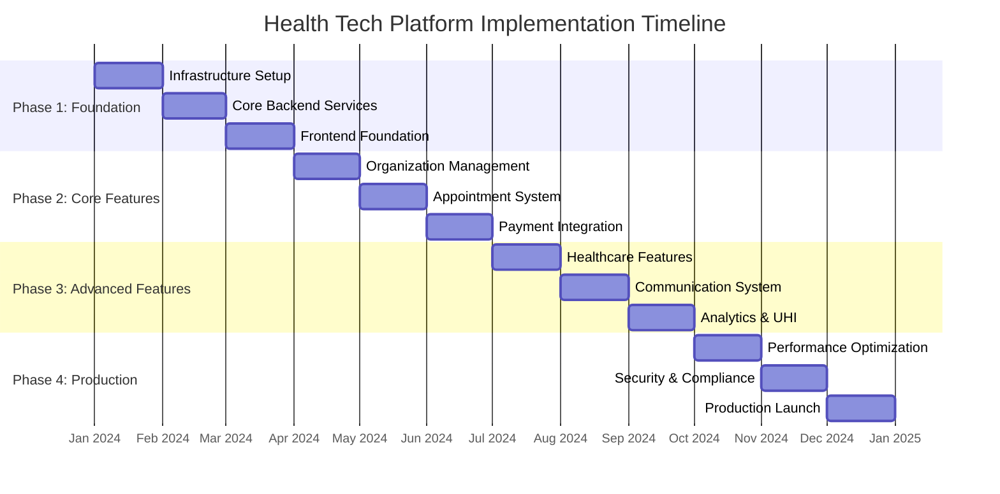
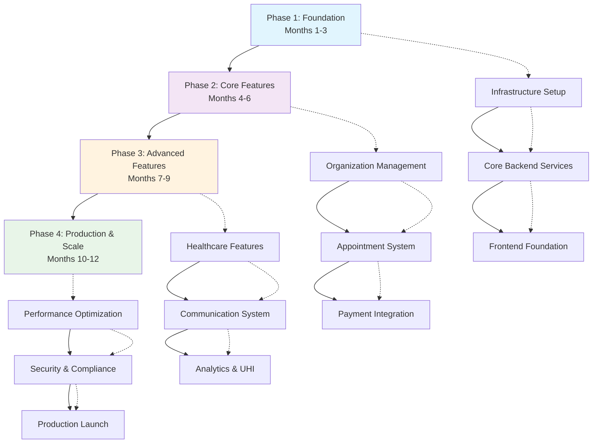
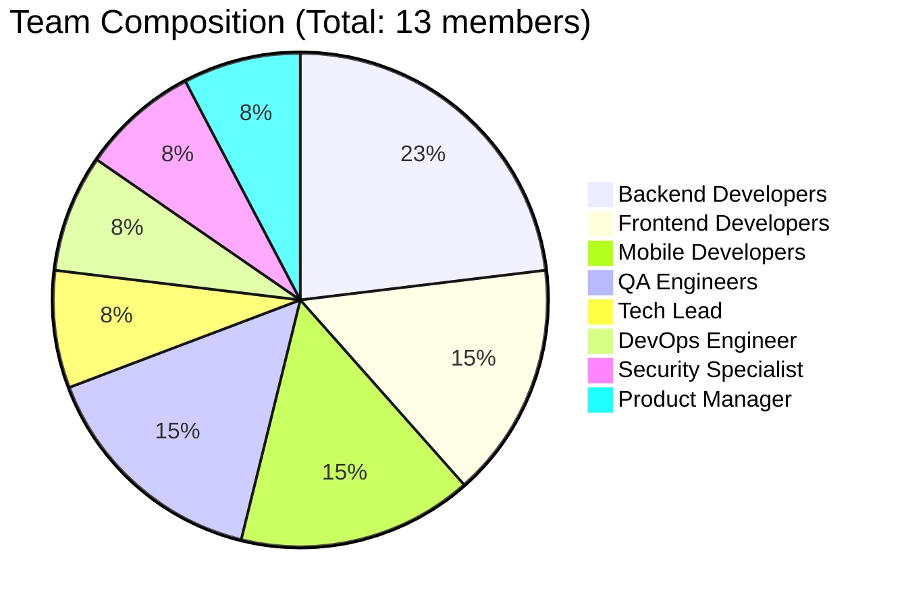
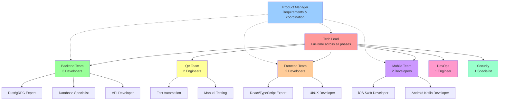
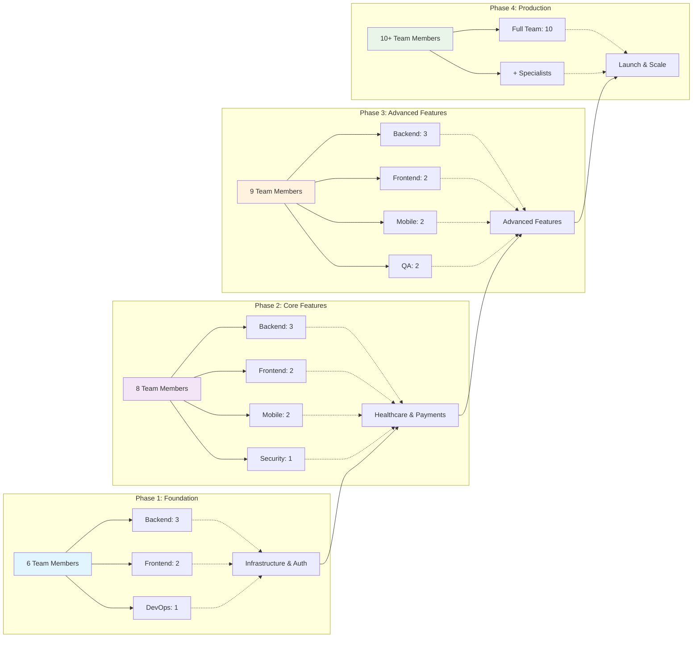
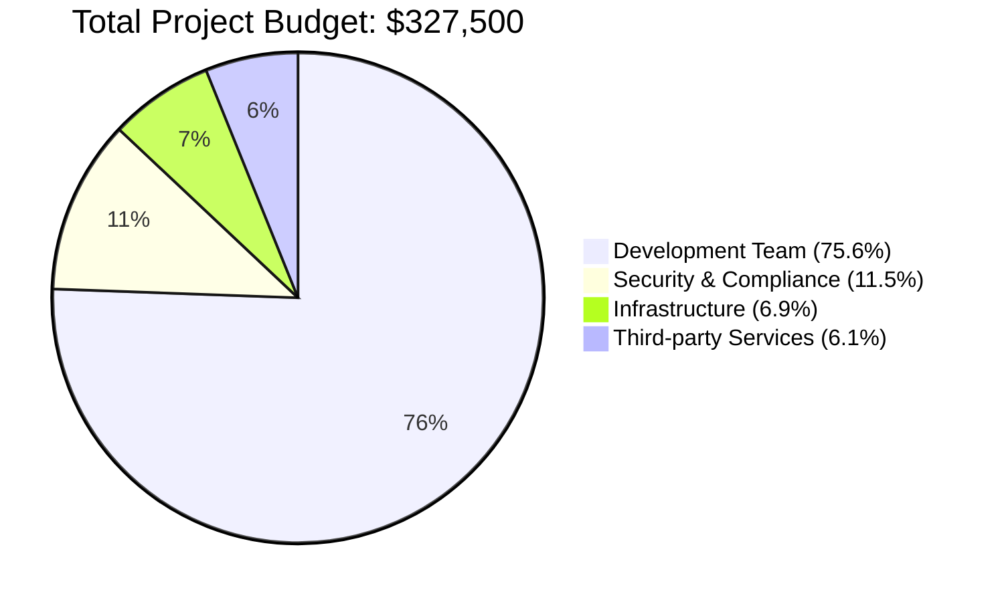
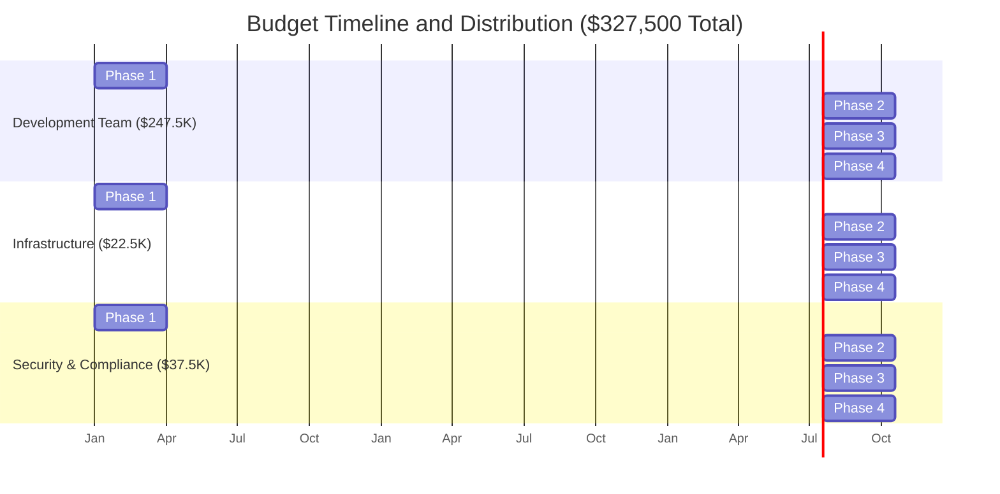
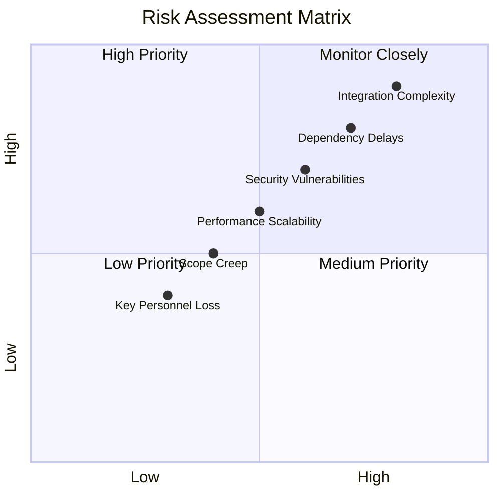
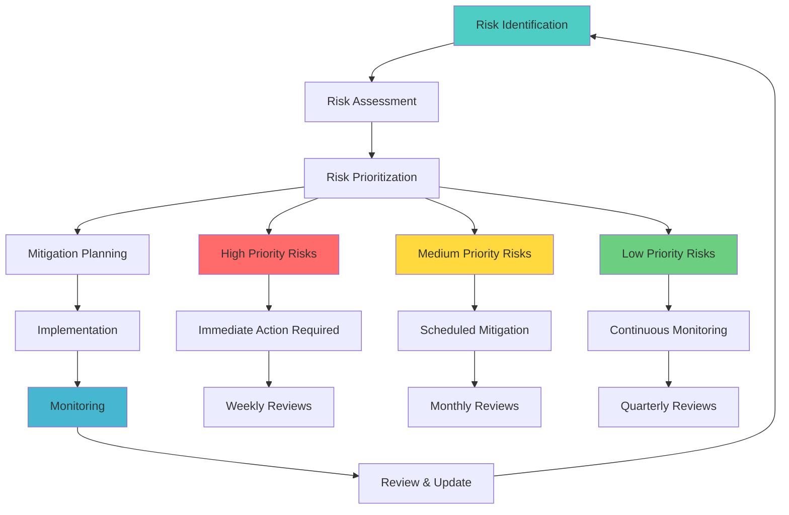

# **Implementation Plan**

## **Project Overview & Timeline**

The health tech platform implementation is structured in **4 major phases** over **12 months**, with each phase building upon the previous one to deliver a fully functional, UHI-compliant healthcare platform.

### **High-Level Timeline Overview**



### **Phase Dependencies & Flow**



---

## **Phase 1: Foundation (Months 1-3)**

### **Objectives**
- Establish development infrastructure and tooling
- Implement core authentication and data layer
- Deploy basic frontend applications
- Set up CI/CD pipelines and monitoring

### **Phase 1.1: Infrastructure Setup (Month 1)**

#### **Week 1-2: Development Environment**
**Tasks:**
- Set up development toolchain (Rust, Node.js, Docker)
- Configure IDE extensions and linting rules
- Establish Git repositories and branching strategy
- Set up project documentation structure

**Deliverables:**
- ✅ Development environment documentation
- ✅ Git repository structure with templates
- ✅ Code style guides and linting configuration
- ✅ Initial project documentation

**Dependencies:** None
**Team:** DevOps + Lead Developers
**Estimated Effort:** 40 hours

#### **Week 3-4: Infrastructure & CI/CD**
**Tasks:**
- Set up Supabase project and database schema
- Configure Docker containers for all services
- Implement GitHub Actions CI/CD pipelines
- Set up monitoring and logging infrastructure

**Deliverables:**
- ✅ Supabase project with initial schema
- ✅ Dockerfiles for all services
- ✅ CI/CD pipelines for automated testing and deployment
- ✅ Prometheus + Grafana monitoring setup

**Dependencies:** Development environment setup
**Team:** DevOps + Backend Team
**Estimated Effort:** 60 hours

### **Phase 1.2: Core Backend Services (Month 2)**

#### **Week 5-6: Identity & Access Management (IAM)**
**Tasks:**
- Implement user registration and authentication
- Set up JWT token generation and validation
- Create role-based access control (RBAC) system
- Implement password reset and MFA

**Deliverables:**
- ✅ User registration and login APIs
- ✅ JWT-based authentication system
- ✅ RBAC with user roles (patient, provider, admin)
- ✅ Password reset flow with email verification
- ✅ MFA setup using TOTP

**Dependencies:** Infrastructure setup
**Team:** Backend Team (2 developers)
**Estimated Effort:** 120 hours

**Key APIs:**
```
POST /auth/register
POST /auth/login
POST /auth/refresh
POST /auth/reset-password
POST /auth/verify-mfa
```

#### **Week 7-8: Backend-for-Frontend (BFF)**
**Tasks:**
- Implement BFF service with Axum framework
- Set up gRPC communication between services
- Create API gateway functionality
- Implement request/response transformation

**Deliverables:**
- ✅ BFF service with REST API endpoints
- ✅ gRPC client connections to backend services
- ✅ Request routing and transformation logic
- ✅ API rate limiting and caching

**Dependencies:** IAM service completion
**Team:** Backend Team (2 developers)
**Estimated Effort:** 100 hours

### **Phase 1.3: Frontend Foundation (Month 3)**

#### **Week 9-10: Web Application**
**Tasks:**
- Set up React application with TypeScript
- Implement authentication UI components
- Create responsive layout and navigation
- Set up state management with Redux Toolkit

**Deliverables:**
- ✅ React application with TypeScript setup
- ✅ Login/register pages with form validation
- ✅ Protected route components
- ✅ Responsive navigation and layout
- ✅ Redux store with authentication slice

**Dependencies:** BFF service, IAM APIs
**Team:** Frontend Team (2 developers)
**Estimated Effort:** 100 hours

#### **Week 11-12: Mobile Applications**
**Tasks:**
- Set up iOS app with SwiftUI
- Set up Android app with Jetpack Compose
- Implement authentication screens
- Configure API communication

**Deliverables:**
- ✅ iOS app with authentication flow
- ✅ Android app with authentication flow
- ✅ API client configuration for both platforms
- ✅ Basic navigation structure

**Dependencies:** BFF service, IAM APIs
**Team:** Mobile Team (2 developers - 1 iOS, 1 Android)
**Estimated Effort:** 120 hours

---

## **Phase 2: Core Features (Months 4-6)**

### **Objectives**
- Implement essential healthcare functionalities
- Enable appointment booking and management
- Integrate payment processing
- Establish UHI compliance foundation

### **Phase 2.1: Organization Management (Month 4)**

#### **Week 13-14: Healthcare Provider Management**
**Tasks:**
- Implement organization registration and verification
- Create provider profile management
- Set up staff management system
- Implement provider search and discovery

**Deliverables:**
- ✅ Provider registration and onboarding flow
- ✅ Organization profile management
- ✅ Staff role management within organizations
- ✅ Provider search API with filtering

**Dependencies:** IAM system, BFF service
**Team:** Backend Team (2 developers)
**Estimated Effort:** 100 hours

**Key APIs:**
```
POST /organizations
PUT /organizations/{id}
GET /organizations/search
POST /organizations/{id}/staff
PUT /staff/{id}/roles
```

#### **Week 15-16: Provider Dashboard (Frontend)**
**Tasks:**
- Create provider dashboard UI
- Implement organization management interface
- Build staff management screens
- Add provider profile editing

**Deliverables:**
- ✅ Provider dashboard with key metrics
- ✅ Organization settings management
- ✅ Staff invitation and role assignment
- ✅ Provider profile editing interface

**Dependencies:** Organization management APIs
**Team:** Frontend Team (2 developers)
**Estimated Effort:** 80 hours

### **Phase 2.2: Appointment System (Month 5)**

#### **Week 17-18: Appointment Management Backend**
**Tasks:**
- Implement appointment booking logic
- Create availability management system
- Set up appointment status tracking
- Implement notification triggers

**Deliverables:**
- ✅ Appointment creation and management APIs
- ✅ Provider availability scheduling
- ✅ Appointment status workflow
- ✅ Automatic notification triggers

**Dependencies:** Organization management
**Team:** Backend Team (3 developers)
**Estimated Effort:** 150 hours

**Key APIs:**
```
POST /appointments
GET /appointments/search
PUT /appointments/{id}/status
GET /providers/{id}/availability
POST /providers/{id}/slots
```

#### **Week 19-20: Appointment Booking UI**
**Tasks:**
- Create appointment search and booking flow
- Implement calendar views for availability
- Build appointment management interface
- Add appointment history and details

**Deliverables:**
- ✅ Provider search and filtering interface
- ✅ Calendar-based appointment booking
- ✅ Appointment confirmation and payment flow
- ✅ My appointments dashboard

**Dependencies:** Appointment management APIs
**Team:** Frontend + Mobile Teams (3 developers)
**Estimated Effort:** 120 hours

### **Phase 2.3: Payment Integration (Month 6)**

#### **Week 21-22: Payment Service Backend**
**Tasks:**
- Integrate with payment gateways (Razorpay, Stripe)
- Implement payment processing workflows
- Create billing and invoice management
- Set up payment security measures

**Deliverables:**
- ✅ Payment gateway integrations
- ✅ Secure payment processing APIs
- ✅ Invoice generation and management
- ✅ Payment status tracking and webhooks

**Dependencies:** Appointment system
**Team:** Backend Team + Security Specialist (3 developers)
**Estimated Effort:** 120 hours

#### **Week 23-24: Payment UI Integration**
**Tasks:**
- Implement payment forms and flows
- Add payment method management
- Create billing history interface
- Integrate payment confirmation

**Deliverables:**
- ✅ Secure payment forms with validation
- ✅ Payment method storage and management
- ✅ Payment history and receipt download
- ✅ Payment confirmation and receipt display

**Dependencies:** Payment service APIs
**Team:** Frontend Team (2 developers)
**Estimated Effort:** 80 hours

---

## **Phase 3: Advanced Features (Months 7-9)**

### **Objectives**
- Implement advanced healthcare features
- Enable real-time communication capabilities
- Add analytics and reporting
- Integrate with UHI network

### **Phase 3.1: Healthcare Features (Month 7)**

#### **Week 25-26: Health Records Management**
**Tasks:**
- Implement electronic health record (EHR) storage
- Create medical document upload and management
- Set up health data privacy controls
- Implement health record sharing mechanisms

**Deliverables:**
- ✅ EHR storage and retrieval system
- ✅ Medical document upload with validation
- ✅ Privacy controls for health data access
- ✅ Secure health record sharing APIs

**Dependencies:** Core platform functionality
**Team:** Backend Team + Security Specialist (3 developers)
**Estimated Effort:** 120 hours

#### **Week 27-28: Teleconsultation System**
**Tasks:**
- Integrate WebRTC for video calling
- Implement session management
- Create consultation recording and notes
- Set up consultation scheduling

**Deliverables:**
- ✅ WebRTC-based video calling system
- ✅ Consultation session management
- ✅ Session notes and prescription writing
- ✅ Consultation scheduling integration

**Dependencies:** Appointment system, health records
**Team:** Backend + Frontend Teams (4 developers)
**Estimated Effort:** 160 hours

### **Phase 3.2: Notification & Communication (Month 8)**

#### **Week 29-30: Notification Service**
**Tasks:**
- Implement multi-channel notification system
- Set up real-time WebSocket connections
- Create notification preferences management
- Integrate with email and SMS providers

**Deliverables:**
- ✅ Multi-channel notification service
- ✅ Real-time WebSocket notifications
- ✅ User notification preferences
- ✅ Email and SMS notification delivery

**Dependencies:** Core services, payment integration
**Team:** Backend Team (2 developers)
**Estimated Effort:** 100 hours

#### **Week 31-32: Discussion Forum**
**Tasks:**
- Implement discussion forum backend
- Create moderation and community features
- Build forum UI components
- Add search and categorization

**Deliverables:**
- ✅ Discussion forum with threading
- ✅ Community moderation tools
- ✅ Forum search and categories
- ✅ User reputation and voting system

**Dependencies:** Notification service
**Team:** Backend + Frontend Teams (3 developers)
**Estimated Effort:** 120 hours

### **Phase 3.3: Analytics & UHI Integration (Month 9)**

#### **Week 33-34: Analytics and Reporting**
**Tasks:**
- Implement analytics data collection
- Create reporting dashboard for providers
- Set up business intelligence metrics
- Add performance monitoring

**Deliverables:**
- ✅ Analytics data pipeline
- ✅ Provider analytics dashboard
- ✅ Business metrics and KPI tracking
- ✅ Performance and usage reports

**Dependencies:** All core features
**Team:** Backend + Frontend Teams (3 developers)
**Estimated Effort:** 120 hours

#### **Week 35-36: UHI Compliance & Integration**
**Tasks:**
- Implement UHI protocol compliance
- Integrate with UHI gateway
- Set up healthcare network connectivity
- Add ABDM integration support

**Deliverables:**
- ✅ UHI protocol implementation
- ✅ Healthcare network integration
- ✅ ABDM service connectivity
- ✅ Compliance validation and testing

**Dependencies:** Core platform completion
**Team:** Backend Team + Integration Specialist (3 developers)
**Estimated Effort:** 140 hours

---

## **Phase 4: Production & Scale (Months 10-12)**

### **Objectives**
- Optimize platform performance and scalability
- Complete security and compliance certification
- Launch production environment
- Implement monitoring and maintenance procedures

### **Phase 4.1: Performance Optimization (Month 10)**

#### **Week 37-38: Backend Optimization**
**Tasks:**
- Optimize database queries and indexing
- Implement advanced caching strategies
- Fine-tune API response times
- Set up load testing and performance monitoring

**Deliverables:**
- ✅ Optimized database performance
- ✅ Redis caching implementation
- ✅ API performance improvements
- ✅ Load testing results and optimizations

**Dependencies:** All features implemented
**Team:** Backend Team + Performance Engineer (3 developers)
**Estimated Effort:** 120 hours

#### **Week 39-40: Frontend Performance**
**Tasks:**
- Optimize bundle sizes and loading times
- Implement lazy loading and code splitting
- Improve mobile app performance
- Set up frontend monitoring

**Deliverables:**
- ✅ Optimized web application performance
- ✅ Mobile app performance improvements
- ✅ Code splitting and lazy loading
- ✅ Frontend performance monitoring

**Dependencies:** All frontend features
**Team:** Frontend + Mobile Teams (3 developers)
**Estimated Effort:** 100 hours

### **Phase 4.2: Security & Compliance (Month 11)**

#### **Week 41-42: Security Hardening**
**Tasks:**
- Conduct comprehensive security audit
- Implement additional security measures
- Set up vulnerability scanning
- Complete penetration testing

**Deliverables:**
- ✅ Security audit report and fixes
- ✅ Enhanced security measures
- ✅ Automated vulnerability scanning
- ✅ Penetration testing clearance

**Dependencies:** All platform features
**Team:** Security Team + Backend Team (4 developers)
**Estimated Effort:** 160 hours

#### **Week 43-44: Compliance Certification**
**Tasks:**
- Complete UHI compliance certification
- Implement healthcare data privacy measures
- Set up audit logging and compliance monitoring
- Prepare compliance documentation

**Deliverables:**
- ✅ UHI compliance certification
- ✅ Healthcare data privacy compliance
- ✅ Audit logging system
- ✅ Compliance documentation package

**Dependencies:** Security hardening
**Team:** Compliance Team + Backend Team (3 developers)
**Estimated Effort:** 120 hours

### **Phase 4.3: Production Launch (Month 12)**

#### **Week 45-46: Production Deployment**
**Tasks:**
- Set up production infrastructure
- Deploy all services to production
- Configure monitoring and alerting
- Conduct final end-to-end testing

**Deliverables:**
- ✅ Production environment setup
- ✅ All services deployed and running
- ✅ Comprehensive monitoring and alerting
- ✅ Production readiness validation

**Dependencies:** Security and compliance clearance
**Team:** DevOps + Full Team (6 developers)
**Estimated Effort:** 200 hours

#### **Week 47-48: Launch & Monitoring**
**Tasks:**
- Execute go-live plan
- Monitor system performance and stability
- Provide user support and documentation
- Plan post-launch improvements

**Deliverables:**
- ✅ Successful production launch
- ✅ System stability confirmation
- ✅ User documentation and support
- ✅ Post-launch improvement roadmap

**Dependencies:** Production deployment
**Team:** Full Team + Support (8 people)
**Estimated Effort:** 160 hours

---

## **Resource Allocation & Team Structure**

### **Core Team Composition**



#### **Team Structure & Roles**



### **Phase-wise Resource Allocation**

```mermaid
gantt
    title Resource Allocation Across Phases
    dateFormat  X
    axisFormat  %s
    
    section Phase 1: Foundation
    Backend Team (3)     :p1-be, 0, 3
    Frontend Team (2)    :p1-fe, 0, 3
    DevOps (1)          :p1-do, 0, 3
    Total: 6 people     :milestone, p1-total, 3, 0
    
    section Phase 2: Core Features
    Backend Team (3)     :p2-be, 3, 6
    Frontend Team (2)    :p2-fe, 3, 6
    Mobile Team (2)      :p2-me, 3, 6
    Security (1)         :p2-se, 3, 6
    Total: 8 people     :milestone, p2-total, 6, 0
    
    section Phase 3: Advanced Features
    Backend Team (3)     :p3-be, 6, 9
    Frontend Team (2)    :p3-fe, 6, 9
    Mobile Team (2)      :p3-me, 6, 9
    QA Team (2)         :p3-qa, 6, 9
    Total: 9 people     :milestone, p3-total, 9, 0
    
    section Phase 4: Production
    Full Team (10)       :p4-all, 9, 12
    Security Expert      :p4-se, 9, 12
    Compliance Expert    :p4-ce, 9, 12
    Total: 10+ people   :milestone, p4-total, 12, 0
```

#### **Detailed Phase Allocation**



### **Budget Estimation (USD)**

#### **Total Budget Distribution**



#### **Phase-wise Budget Breakdown**

```mermaid
gantt
    title Budget Allocation by Phase (USD)
    dateFormat  X
    axisFormat  %s
    
    section Phase 1: $55K
    Budget Allocation    :55, 0, 1
    
    section Phase 2: $76K
    Budget Allocation    :76, 1, 2
    
    section Phase 3: $89.5K
    Budget Allocation    :89, 2, 3
    
    section Phase 4: $107K
    Budget Allocation    :107, 3, 4
```



#### **Budget Category Analysis**



#### **Detailed Budget Table**

| Category | Phase 1 | Phase 2 | Phase 3 | Phase 4 | Total |
|----------|---------|---------|---------|---------|-------|
| Development Team | $45,000 | $60,000 | $67,500 | $75,000 | $247,500 |
| Infrastructure | $3,000 | $4,500 | $6,000 | $9,000 | $22,500 |
| Third-party Services | $2,000 | $4,000 | $6,000 | $8,000 | $20,000 |
| Security & Compliance | $5,000 | $7,500 | $10,000 | $15,000 | $37,500 |
| **Total per Phase** | **$55,000** | **$76,000** | **$89,500** | **$107,000** | **$327,500** |

---

## **Risk Management & Mitigation**

### **Risk Assessment Matrix**



### **Risk Mitigation Strategy Flow**



### **Technical Risks**

#### **High Risk: Integration Complexity**
- **Risk**: Complex integrations with UHI, payment gateways, and external services
- **Impact**: Delays in development, potential system instability
- **Probability**: 80% | **Impact**: High
- **Mitigation**: 
  - Early prototype development for critical integrations
  - Dedicated integration testing environment
  - Fallback mechanisms for external service failures
  - Weekly integration review meetings

#### **Medium Risk: Performance Scalability**
- **Risk**: System may not handle expected user load
- **Impact**: Poor user experience, system crashes
- **Probability**: 50% | **Impact**: Medium
- **Mitigation**:
  - Regular load testing throughout development
  - Performance benchmarks at each phase
  - Horizontal scaling architecture design
  - Performance monitoring and alerting

#### **Medium Risk: Security Vulnerabilities**
- **Risk**: Healthcare data security breaches
- **Impact**: Compliance violations, legal issues, reputation damage
- **Probability**: 60% | **Impact**: High
- **Mitigation**:
  - Security reviews at each development phase
  - Automated security scanning in CI/CD
  - Regular penetration testing
  - Security specialist involvement in critical phases

### **Timeline Risks**

#### **High Risk: Dependency Delays**
- **Risk**: Dependencies between teams causing cascading delays
- **Impact**: Overall project timeline extension
- **Probability**: 70% | **Impact**: High
- **Mitigation**:
  - Clear API contracts defined early
  - Parallel development with mock services
  - Regular cross-team synchronization meetings
  - Buffer time in critical path activities

#### **Medium Risk: Scope Creep**
- **Risk**: Additional feature requests during development
- **Impact**: Timeline delays, budget overruns
- **Probability**: 40% | **Impact**: Medium
- **Mitigation**:
  - Strict change management process
  - Feature prioritization framework
  - Regular stakeholder alignment meetings
  - Change request approval workflow

### **Resource Risks**

#### **Medium Risk: Key Personnel Unavailability**
- **Risk**: Loss of critical team members
- **Impact**: Knowledge loss, development delays
- **Probability**: 30% | **Impact**: Medium
- **Mitigation**:
  - Comprehensive documentation requirements
  - Knowledge sharing sessions
  - Cross-training between team members
  - Backup resource identification

---

## **Success Metrics & Milestones**

### **Technical Milestones**

#### **Phase 1 Success Criteria**
- ✅ All services deployed and accessible
- ✅ Authentication system functional with 99.9% uptime
- ✅ CI/CD pipeline operational with automated testing
- ✅ Basic frontend applications responsive and functional

#### **Phase 2 Success Criteria**
- ✅ End-to-end appointment booking flow functional
- ✅ Payment processing integrated and tested
- ✅ Provider onboarding and management operational
- ✅ Mobile applications published to app stores (beta)

#### **Phase 3 Success Criteria**
- ✅ Teleconsultation system operational with video calling
- ✅ Real-time notifications working across all channels
- ✅ UHI compliance implemented and validated
- ✅ Analytics dashboard providing meaningful insights

#### **Phase 4 Success Criteria**
- ✅ Production system handling target load (10,000 concurrent users)
- ✅ Security audit passed with no critical vulnerabilities
- ✅ Compliance certification obtained
- ✅ Production launch successful with 99.5% uptime

### **Business Metrics**

#### **Post-Launch Targets (First 6 months)**
- **User Registration**: 10,000 patients, 500 healthcare providers
- **Appointments Booked**: 5,000 successful appointments
- **Platform Availability**: 99.5% uptime
- **User Satisfaction**: 4.5+ star rating in app stores
- **Support Response**: < 2 hours for critical issues

### **Performance Benchmarks**
- **API Response Times**: 95th percentile under defined limits
- **Page Load Times**: < 3 seconds for all critical pages
- **Mobile App Performance**: < 3 seconds cold start time
- **Database Performance**: < 100ms for standard queries

---

This comprehensive implementation plan provides a structured approach to building the health tech platform with clear timelines, deliverables, and success criteria for each phase.
